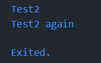
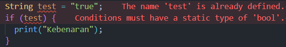
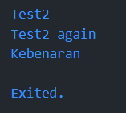
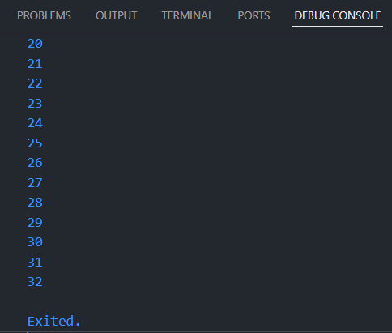
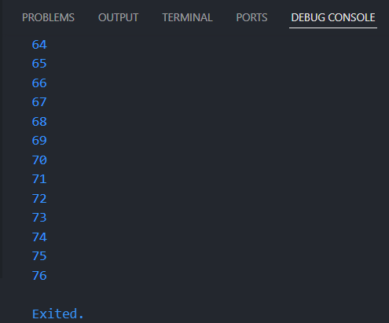
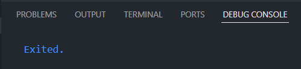

## This repository is belongs to

Muhammad Naufal Haidar Setyawan <br>
2241720097 / TI-3F <br>

### Praktikum 1: Menerapkan Control Flows ("if/else")

#### Langkah 1:

Ketik atau salin kode program berikut ke dalam fungsi main().

```
String test = "test2";
if (test == "test1") {
   print("Test1");
} else If (test == "test2") {
   print("Test2");
} Else {
   print("Something else");
}

if (test == "test2") print("Test2 again");
```

#### Langkah 2:

Silakan coba eksekusi (Run) kode pada langkah 1 tersebut. Apa yang terjadi? Jelaskan!

**Jawab :** <br>


#### Langkah 3:

Tambahkan kode program berikut, lalu coba eksekusi (Run) kode Anda.

```
String test = "true";
if (test) {
   print("Kebenaran");
}
```

Apa yang terjadi ? Jika terjadi error, silakan perbaiki namun tetap menggunakan if/else.

**Jawab :**

Terdapat 2 kesalahan : <br>

1. Variabel test telah dideklarasi sebelumnya dengan tipe data String. Maka, jika ingin mengganti valuenya saja dapat menggunakan `test = "true";`.
2. Dalam pengkondisian if else, nilai yang diharapkan dalam if () maka harus memiliki nilai boolean (true/false), sedangkan test memiliki tipe data String. Maka, jika ingin mengecek apakah nilai test = "true", dapat dengan merubah kode akhir dengan

   ```
   test = "true";
   if (test == "true") {
      print("Kebenaran");
   } else {
      print("Kesalahan");
   }
   ```

   _Output :_ <br>
   

### Praktikum 2: Menerapkan Perulangan "while" dan "do-while"

#### Langkah 1:

Ketik atau salin kode program berikut ke dalam fungsi main().

```
while (counter < 33) {
  print(counter);
  counter++;
}
```

#### Langkah 2:

Silakan coba eksekusi (Run) kode pada langkah 1 tersebut. Apa yang terjadi? Jelaskan! Lalu perbaiki jika terjadi error.

**Jawab :**
Terjadi error, karena variabel `counter` belum dideklarasi sebelumnya. Dapat dengan mengubah kode menjadi seperti berikut

```
int counter = 0;
while (counter < 33) {
   print(counter);
   counter++;
}
```

_Output :_ <br>


#### Langkah 3:

Tambahkan kode program berikut, lalu coba eksekusi (Run) kode Anda.

```
do {
  print(counter);
  counter++;
} while (counter < 77);
```

Apa yang terjadi ? Jika terjadi error, silakan perbaiki namun tetap menggunakan do-while.

**Jawab :**

Perulangan sebelumnya berhenti di counter = 32, namun dengan tambahan kode diatas maka perulangan counter berlanjut hingga counter = 76. Perbedaan while dan do while adalah while akan mengecek terlebih dahulu kondisi untuk melakukan perulangan, kemudian akan melakukan perintah saat bernilai true. Sedangkan do while akan melakukan perintah terlebih dahulu, kemudian mengecek kondisi untuk melakukan perulangan selanjutnya.

### Praktikum 3: Menerapkan Perulangan "for" dan "break-continue"

#### Langkah 1:

Ketik atau salin kode program berikut ke dalam fungsi main().

```
for (Index = 10; index < 27; index) {
  print(Index);
}
```

#### Langkah 2:

Silakan coba eksekusi (Run) kode pada langkah 1 tersebut. Apa yang terjadi? Jelaskan! Lalu perbaiki jika terjadi error.

**Jawab :**
Terjadi error karena variabel index belum dideklarasi sebelumnya. Dapat diperbaiki dengan kode berikut :

```
for (int index = 10; index < 27; index++) {
  print(index);
}
```

#### Langkah 3:

Tambahkan kode program berikut di dalam for-loop, lalu coba eksekusi (Run) kode Anda.

```
If (Index == 21) break;
Else If (index > 1 || index < 7) continue;
print(index);
```

Apa yang terjadi ? Jika terjadi error, silakan perbaiki namun tetap menggunakan for dan break-continue.
**Jawab :**

1. Kesalahan pada sintaks, yang benar adalah :
   ```
   if (index == 21) break;
   else if (index > 1 || index < 7) continue;
   print(index);
   ```
2. Saat dijalankan :
   
   Ketika index mencapai angka 21, maka perulangan akan berhenti. Namun jika index masih berada dalam kisaran lebih dari 1 **ATAU** kurang dari 7 maka perulangan akan dilanjutkan pada putaran selanjutnya. <br>
   Perintah `print(index);` tidak akan pernah sampai dikerjakan karena saat pengecekan `else if (index > 1 || index < 7)` akan menjalankan perintah `continue;`

### Tugas Praktikum

Buatlah sebuah program yang dapat menampilkan bilangan prima dari angka 0 sampai 201 menggunakan Dart. Ketika bilangan prima ditemukan, maka tampilkan nama lengkap dan NIM Anda.

**Jawab :**

```
void main() {
  for (int i = 0; i <= 201; i++) {
    bool prima = true;

    for (int j = 2; j <= i / 2; j++) {
      if (i % j == 0) {
        prima = false;
        break;
      }
    }

    if (prima && i != 0 && i != 1)
      print("$i | Muhammad Naufal Haidar Setyawan, 2241720097");
  }
}
```

akan menghasilkan output :

```
2 | Muhammad Naufal Haidar Setyawan, 2241720097
3 | Muhammad Naufal Haidar Setyawan, 2241720097
5 | Muhammad Naufal Haidar Setyawan, 2241720097
7 | Muhammad Naufal Haidar Setyawan, 2241720097
11 | Muhammad Naufal Haidar Setyawan, 2241720097
13 | Muhammad Naufal Haidar Setyawan, 2241720097
17 | Muhammad Naufal Haidar Setyawan, 2241720097
19 | Muhammad Naufal Haidar Setyawan, 2241720097
23 | Muhammad Naufal Haidar Setyawan, 2241720097
29 | Muhammad Naufal Haidar Setyawan, 2241720097
31 | Muhammad Naufal Haidar Setyawan, 2241720097
37 | Muhammad Naufal Haidar Setyawan, 2241720097
41 | Muhammad Naufal Haidar Setyawan, 2241720097
43 | Muhammad Naufal Haidar Setyawan, 2241720097
47 | Muhammad Naufal Haidar Setyawan, 2241720097
53 | Muhammad Naufal Haidar Setyawan, 2241720097
59 | Muhammad Naufal Haidar Setyawan, 2241720097
61 | Muhammad Naufal Haidar Setyawan, 2241720097
67 | Muhammad Naufal Haidar Setyawan, 2241720097
71 | Muhammad Naufal Haidar Setyawan, 2241720097
73 | Muhammad Naufal Haidar Setyawan, 2241720097
79 | Muhammad Naufal Haidar Setyawan, 2241720097
83 | Muhammad Naufal Haidar Setyawan, 2241720097
89 | Muhammad Naufal Haidar Setyawan, 2241720097
97 | Muhammad Naufal Haidar Setyawan, 2241720097
101 | Muhammad Naufal Haidar Setyawan, 2241720097
103 | Muhammad Naufal Haidar Setyawan, 2241720097
107 | Muhammad Naufal Haidar Setyawan, 2241720097
109 | Muhammad Naufal Haidar Setyawan, 2241720097
113 | Muhammad Naufal Haidar Setyawan, 2241720097
127 | Muhammad Naufal Haidar Setyawan, 2241720097
131 | Muhammad Naufal Haidar Setyawan, 2241720097
137 | Muhammad Naufal Haidar Setyawan, 2241720097
139 | Muhammad Naufal Haidar Setyawan, 2241720097
149 | Muhammad Naufal Haidar Setyawan, 2241720097
151 | Muhammad Naufal Haidar Setyawan, 2241720097
157 | Muhammad Naufal Haidar Setyawan, 2241720097
163 | Muhammad Naufal Haidar Setyawan, 2241720097
167 | Muhammad Naufal Haidar Setyawan, 2241720097
173 | Muhammad Naufal Haidar Setyawan, 2241720097
179 | Muhammad Naufal Haidar Setyawan, 2241720097
181 | Muhammad Naufal Haidar Setyawan, 2241720097
191 | Muhammad Naufal Haidar Setyawan, 2241720097
193 | Muhammad Naufal Haidar Setyawan, 2241720097
197 | Muhammad Naufal Haidar Setyawan, 2241720097
199 | Muhammad Naufal Haidar Setyawan, 2241720097

Exited.
```
