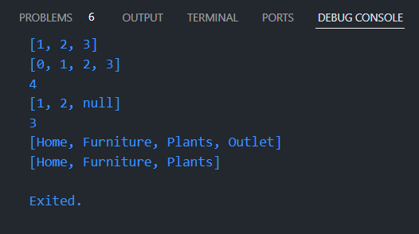

## This repository is belongs to

Muhammad Naufal Haidar Setyawan <br>
2241720097 / TI-3F <br>

### Praktikum 1 : Eksperimen Tipe Data List

#### Langkah 1:

Ketik atau salin kode program berikut ke dalam void `main()`.

```
var list = [1, 2, 3];
assert(list.length == 3);
assert(list[1] == 2);
print(list.length);
print(list[1]);

list[1] = 1;
assert(list[1] == 1);
print(list[1]);
```

#### Langkah 2:

Silakan coba eksekusi (Run) kode pada langkah 1 tersebut. Apa yang terjadi? Jelaskan! <br>

**Jawab :** <br>
 <br>
Fungsi assert akan memastikan kondisi boolean pada ketentuan yang diminta bernilai true. Apabila ternyata bernilai false, maka kode akan terhenti dan menampilkan pesan error seperti ini. <br>
 <br>

#### Langkah 3:

Ubah kode pada langkah 1 menjadi variabel final yang mempunyai index = 5 dengan default value = `null`. Isilah nama dan NIM Anda pada elemen index ke-1 dan ke-2. Lalu print dan capture hasilnya.

Apa yang terjadi ? Jika terjadi error, silakan perbaiki.

**Jawab :** <br>

```
void main() {
  final list = [null, null, null, null, null];
  list[1] = 'Muhammad Naufal Haidar Setyawan';
  list[2] = '2241720097';
  print(list);
}
```

 <br>
Terjadi error karena variabel final list terdeteksi sebagai `List<Null>` (array dengan tipe data null). Seharusnya kita juga harus definisikan tipe datanya setelah sintaks `final` : <br>

```
final List<String?> list = [null, null, null, null, null];
```

 <br>

### Praktikum 2: Eksperimen Tipe Data Set

#### Langkah 1:

Ketik atau salin kode program berikut ke dalam fungsi `main()`.

```
var halogens = {'fluorine', 'chlorine', 'bromine', 'iodine', 'astatine'};
print(halogens);
```

#### Langkah 2:

Silakan coba eksekusi (Run) kode pada langkah 1 tersebut. Apa yang terjadi? Jelaskan! Lalu perbaiki jika terjadi error.

**Jawab :** <br>

 <br>
Menampilkan nilai dari variabel `halogens` berupa set.

#### Langkah 3:

Tambahkan kode program berikut, lalu coba eksekusi (Run) kode Anda.

```
var names1 = <String>{};
Set<String> names2 = {}; // This works, too.
var names3 = {}; // Creates a map, not a set.

print(names1);
print(names2);
print(names3);
```

Apa yang terjadi ? Jika terjadi error, silakan perbaiki namun tetap menggunakan ketiga variabel tersebut. Tambahkan elemen nama dan NIM Anda pada kedua variabel Set tersebut dengan dua fungsi berbeda yaitu `.add()` dan `.addAll()`. Untuk variabel Map dihapus, nanti kita coba di praktikum selanjutnya.

Dokumentasikan code dan hasil di console, lalu buat laporannya.

**Jawab :** <br>

```
void main() {
  var halogens = {'fluorine', 'chlorine', 'bromine', 'iodine', 'astatine'};
  print(halogens);

  var names1 = <String>{};
  Set<String> names2 = {}; // This works, too.
  // var names3 = {}; // Creates a map, not a set.

  print(names1);
  print(names2);
  // print(names3);

  names1.add("Muhammad Naufal Haidar Setyawan");
  names1.add("2241720097");
  names2.addAll({"Muhammad Naufal Haidar Setyawan", "2241720097"});
  print(names1);
  print(names2);
}
```

 <br>
Fungsi `.add()` akan menambahkan 1 value saja (dalam konteks ini adalah String) sedangkan `.addAll()` akan menambahkan 1 atau lebih value berupa Set (dalam konteks ini adalah `Set<String>`).

### Praktikum 3: Eksperimen Tipe Data Maps

#### Langkah 1:

Ketik atau salin kode program berikut ke dalam fungsi main().

```
var gifts = {
  // Key:    Value
  'first': 'partridge',
  'second': 'turtledoves',
  'fifth': 1
};

var nobleGases = {
  2: 'helium',
  10: 'neon',
  18: 2,
};

print(gifts);
print(nobleGases);
```

#### Langkah 2:

Silakan coba eksekusi (Run) kode pada langkah 1 tersebut. Apa yang terjadi? Jelaskan! Lalu perbaiki jika terjadi error.

**Jawab :** <br>

 <br>
Menampilkan nilai dari variabel `gifts` dan `nobleGases` berupa maps.

#### Langkah 3:

Tambahkan kode program berikut, lalu coba eksekusi (Run) kode Anda.

```
var mhs1 = Map<String, String>();
gifts['first'] = 'partridge';
gifts['second'] = 'turtledoves';
gifts['fifth'] = 'golden rings';

var mhs2 = Map<int, String>();
nobleGases[2] = 'helium';
nobleGases[10] = 'neon';
nobleGases[18] = 'argon';
```

Apa yang terjadi ? Jika terjadi error, silakan perbaiki.

Tambahkan elemen nama dan NIM Anda pada tiap variabel di atas (`gifts`, `nobleGases`, `mhs1`, dan `mhs2`). Dokumentasikan hasilnya dan buat laporannya!

**Jawab :** <br>

```
void main() {
  var gifts = {
    // Key:    Value
    'first': 'partridge',
    'second': 'turtledoves',
    'fifth': 1
  };

  var nobleGases = {
    2: 'helium',
    10: 'neon',
    18: 2,
  };

  print(gifts);
  print(nobleGases);

  var mhs1 = Map<String, String>();
  gifts['first'] = 'partridge';
  gifts['second'] = 'turtledoves';
  gifts['fifth'] = 'golden rings';

  var mhs2 = Map<int, String>();
  nobleGases[2] = 'helium';
  nobleGases[10] = 'neon';
  nobleGases[18] = 'argon';

  mhs1.addAll({
    'nama': 'Muhammad Naufal Haidar Setyawan',
    'nim': '2241720097',
  });
  mhs2.addAll({
    26: 'Muhammad Naufal Haidar Setyawan',
    34: '2241720097',
  });
  gifts.addAll({
    'nama': 'Muhammad Naufal Haidar Setyawan',
    'nim': '2241720097',
  });
  nobleGases.addAll({
    26: 'Muhammad Naufal Haidar Setyawan',
    34: '2241720097',
  });

  print(mhs1);
  print(mhs2);
  print(gifts);
  print(nobleGases);
}
```

 <br>
Menambahkan value ke dalam maps menggunakan fungsi `.addAll()`.

### Praktikum 4: Eksperimen Tipe Data List: Spread dan Control-flow Operators

#### Langkah 1:

Ketik atau salin kode program berikut ke dalam fungsi `main()`.

```
var list = [1, 2, 3];
var list2 = [0, ...list];
print(list1);
print(list2);
print(list2.length);
```

#### Langkah 2:

Silakan coba eksekusi (Run) kode pada langkah 1 tersebut. Apa yang terjadi? Jelaskan! Lalu perbaiki jika terjadi error.

**Jawab :** <br>

 <br>

Terjadi error karena tidak ditemukan variabel `list1`. Dapat diperbaiki dengan mengganti `var list` menjadi `var list1` atau `print(list1)` menjadi `print(list)`. <br>

 <br>

#### Langkah 3:

Tambahkan kode program berikut, lalu coba eksekusi (Run) kode Anda.

```
list1 = [1, 2, null];
print(list1);
var list3 = [0, ...?list1];
print(list3.length);
```

Apa yang terjadi ? Jika terjadi error, silakan perbaiki.

Tambahkan variabel list berisi NIM Anda menggunakan Spread Operators. Dokumentasikan hasilnya dan buat laporannya!

**Jawab :** <br>

 <br>

Dapat diatasi dengan mendeklarasikan tipe data dari variabel list1 <br>

 <br>

Operator `...?` (null-aware spread operator) digunakan untuk mencegah penyebaran objek null, tetapi hanya pada keseluruhan list yang null. Jika ada elemen null di dalam list, itu tidak akan ditangani oleh operator tersebut, sehingga tetap terjadi error. <br>
Untuk mengatasi ini, bisa dengan mengganti elemen null dengan nilai yang valid, atau memfilter nilai null sebelum menyebarkannya.

```
var list1 = [1, 2, null];
print(list1);
var list3 = [0, ...list1.where((element) => element != null)];
print(list3.length);
```

#### Langkah 4:

Tambahkan kode program berikut, lalu coba eksekusi (Run) kode Anda.

```
var nav = ['Home', 'Furniture', 'Plants', if (promoActive) 'Outlet'];
print(nav);
```

Apa yang terjadi ? Jika terjadi error, silakan perbaiki. Tunjukkan hasilnya jika variabel `promoActive` ketika `true` dan `false`.

**Jawab :** <br>

```
bool promoActive = true;
var nav = ['Home', 'Furniture', 'Plants', if (promoActive) 'Outlet'];
print(nav);

promoActive = false;
nav = ['Home', 'Furniture', 'Plants', if (promoActive) 'Outlet'];
print(nav);
```

 <br>

#### Langkah 5:

Tambahkan kode program berikut, lalu coba eksekusi (Run) kode Anda.

```
var nav2 = ['Home', 'Furniture', 'Plants', if (login case 'Manager') 'Inventory'];
print(nav2);
```

Apa yang terjadi ? Jika terjadi error, silakan perbaiki. Tunjukkan hasilnya jika variabel `login` mempunyai kondisi lain.

**Jawab :** <br>

```
String login = 'Manager';
var nav2 = ['Home', 'Furniture', 'Plants', if (login case 'Manager') 'Inventory'];
print(nav2);

login = 'Employee';
nav2 = ['Home', 'Furniture', 'Plants', if (login case 'Manager') 'Inventory'];
print(nav2);
```


#### Langkah 6:

Tambahkan kode program berikut, lalu coba eksekusi (Run) kode Anda.

```
var listOfInts = [1, 2, 3];
var listOfStrings = ['#0', for (var i in listOfInts) '#$i'];
assert(listOfStrings[1] == '#1');
print(listOfStrings);
```

Apa yang terjadi ? Jika terjadi error, silakan perbaiki. Jelaskan manfaat **Collection For** dan dokumentasikan hasilnya.

**Jawab :** <br>
 <br>
**Collection for** dalam Dart adalah fitur yang memungkinkan kita menggunakan loop `for` di dalam koleksi seperti list, set, atau map. Ini membuat penulisan kode lebih ringkas dan lebih mudah dibaca ketika kita ingin menghasilkan _collection_ berdasarkan logika tertentu.

### Praktikum 5: Eksperimen Tipe Data Records

#### Langkah 1:

Ketik atau salin kode program berikut ke dalam fungsi `main()`.

```
var record = ('first', a: 2, b: true, 'last');
print(record)
```

**Jawab :** <br>
 <br>
Kode perbaikan : <br>

```
var record = ('first', a: 2, b: true, 'last');
print(record);
```

#### Langkah 2:

Silakan coba eksekusi (Run) kode pada langkah 1 tersebut. Apa yang terjadi? Jelaskan! Lalu perbaiki jika terjadi error.

**Jawab :** <br>
 <br>
Akan menampilkan variabel record yang berupa Records.

#### Langkah 3:

Tambahkan kode program berikut di luar scope `void main()`, lalu coba eksekusi (Run) kode Anda.

```
(int, int) tukar((int, int) record) {
  var (a, b) = record;
  return (b, a);
}
```

Apa yang terjadi ? Jika terjadi error, silakan perbaiki. Gunakan fungsi `tukar()` di dalam `main()` sehingga tampak jelas proses pertukaran value field di dalam Records.

**Jawab :** <br>
Untuk menggunakan fungsi `tukar()` harus dipanggil di dalam `main()`.

```
var record2 = (1, 2);
var record3 = tukar(record2);
print(record3);
```


#### Langkah 4:

Tambahkan kode program berikut di dalam scope `void main()`, lalu coba eksekusi (Run) kode Anda.

```
// Record type annotation in a variable declaration:
(String, int) mahasiswa;
print(mahasiswa);
```

Apa yang terjadi ? Jika terjadi error, silakan perbaiki. Inisialisasi field nama dan NIM Anda pada variabel record `mahasiswa` di atas. Dokumentasikan hasilnya dan buat laporannya!

**Jawab :** <br>
 <br>
Terjadi error karena variabel mahasiswa sebelumnya tidak memiliki value, seharusnya :

```
// Record type annotation in a variable declaration:
(String, int) mahasiswa;
mahasiswa = ('Muhammad Naufal Haidar Setyawan', 2241720097);
print(mahasiswa);
```

 <br>

#### Langkah 5:

Tambahkan kode program berikut di dalam scope `void main()`, lalu coba eksekusi (Run) kode Anda.

```
var mahasiswa2 = ('first', a: 2, b: true, 'last');

print(mahasiswa2.$1); // Prints 'first'
print(mahasiswa2.a); // Prints 2
print(mahasiswa2.b); // Prints true
print(mahasiswa2.$2); // Prints 'last'
```

Apa yang terjadi ? Jika terjadi error, silakan perbaiki. Gantilah salah satu isi record dengan nama dan NIM Anda, lalu dokumentasikan hasilnya dan buat laporannya!

**Jawab :** <br>
Menampilkan seluruh elemen dalam Records. <br>
 <br>

```
var mahasiswa2 = ('first', a: "Muhammad Naufal Haidar Setyawan", b: 2241720097, 'last');

print(mahasiswa2.$1);
print(mahasiswa2.a);
print(mahasiswa2.b);
print(mahasiswa2.$2);
```

 <br>

### Tugas Praktikum

1. Jelaskan yang dimaksud Functions dalam bahasa Dart! <br>
   **Jawab :** <br>
   Functions di Dart adalah blok kode yang dapat dipanggil dan dieksekusi untuk menyelesaikan tugas tertentu. Mereka bisa menerima input (parameter) dan mengembalikan output (nilai). Dart mendukung berbagai fitur dalam function seperti parameter opsional, anonymous functions, dan closures. Contoh :

   ```
   void sayHello(String name) {
     print('Hello, $name!');
   }

   void main() {
     sayHello('Alice');  // Output: Hello, Alice!
   }
   ```

2. Jelaskan jenis-jenis parameter di Functions beserta contoh sintaksnya! <br>
   **Jawab :** <br>

   - **Positional Parameters**: Parameter yang posisinya harus tepat ketika memanggil function.

     ```
     void greet(String name, int age) {
       print('Hello $name, you are $age years old');
     }

     void main() {
       greet('Alice', 25);
     }
     ```

   - **Optional Positional Parameters**: Parameter opsional yang tidak harus diberikan saat function dipanggil.

     ```
     void greet(String name, [int? age]) {
       print('Hello $name${age != null ? ", you are $age" : ""}');
     }

     void main() {
       greet('Alice');  // Output: Hello Alice
     }
     ```

   - **Named Parameters**: Parameter yang disebutkan dengan nama, membuat kode lebih eksplisit.

     ```
     void greet({required String name, int? age}) {
       print('Hello $name${age != null ? ", you are $age" : ""}');
     }

     void main() {
       greet(name: 'Alice', age: 25);
     }
     ```

   - **Default Parameters**: Parameter dengan nilai default jika tidak disediakan.

     ```
     void greet(String name, {int age = 18}) {
       print('Hello $name, you are $age years old');
     }

     void main() {
       greet('Alice');  // Output: Hello Alice, you are 18 years old
     }
     ```

3. Jelaskan maksud Functions sebagai first-class objects beserta contoh sintaknya! <br>
   **Jawab :** <br>
   Dart memperlakukan functions sebagai objek "first-class," yang berarti function dapat disimpan dalam variabel, diteruskan sebagai argumen ke function lain, atau dikembalikan dari function lain. Contoh:

   ```
    void sayHello() {
      print('Hello');
    }

    void main() {
      var greet = sayHello;  // Menyimpan function dalam variabel
      greet();               // Memanggil function melalui variabel
    }
   ```

4. Apa itu Anonymous Functions? Jelaskan dan berikan contohnya! <br>
   **Jawab :** <br>
   Anonymous functions (fungsi tanpa nama) adalah function yang **dideklarasikan tanpa nama** dan biasanya digunakan sebagai argumen untuk function lain atau disimpan dalam variabel. Contoh :

   ```
    var multiply = (int a, int b) {
      return a * b;
    };

    void main() {
      print(multiply(3, 4));  // Output: 12
    }
   ```

   Anonymous Function sebagai Argumen: <br>

   ```
    void execute(Function callback) {
      callback();
    }

    void main() {
      execute(() {
        print('Anonymous function executed');
      });
    }
   ```

5. Jelaskan perbedaan Lexical scope dan Lexical closures! Berikan contohnya! <br>
   **Jawab :** <br>

   - **Lexical Scope**: Area di mana variabel-variabel yang didefinisikan dalam lingkup tersebut dapat diakses. Dart memiliki lexical scope, artinya variabel didefinisikan dalam ruang lingkup tertentu hanya dapat diakses di ruang lingkup tersebut atau yang lebih dalam. Contoh :

     ```
      void main() {
        int outerVar = 10;

        void innerFunction() {
          print(outerVar);  // outerVar dapat diakses di dalam scope ini
        }

        innerFunction();
      }
     ```

   - **Lexical Closures**: Closure adalah function yang "mengingat" lingkup di mana ia didefinisikan, bahkan ketika function itu dieksekusi di luar lingkup aslinya. Contoh :

     ```
      Function makeAdder(int addBy) {
        return (int i) => addBy + i;
      }

      void main() {
        var add2 = makeAdder(2);
        print(add2(3));  // Output: 5
      }
     ```

6. Jelaskan dengan contoh cara membuat return multiple value di Functions! <br>
   **Jawab :** <br>
   Dart tidak memiliki dukungan langsung untuk mengembalikan beberapa nilai, tetapi kita bisa menggunakan:

   - List atau Map untuk mengembalikan lebih dari satu nilai.
   - Record (di Dart 3.0) yang memungkinkan mengembalikan beberapa nilai tanpa membuat kelas khusus.

   Contoh Menggunakan List:

   ```
   List<int> swap(int a, int b) {
     return [b, a];
   }

   void main() {
     var result = swap(1, 2);
     print(result);  // Output: [2, 1]
   }
   ```

   Contoh Menggunakan Record (Dart 3.0):

   ```
   (int, int) swap(int a, int b) {
     return (b, a);
   }

   void main() {
     var result = swap(1, 2);
     print(result);  // Output: (2, 1)
   }
   ```
