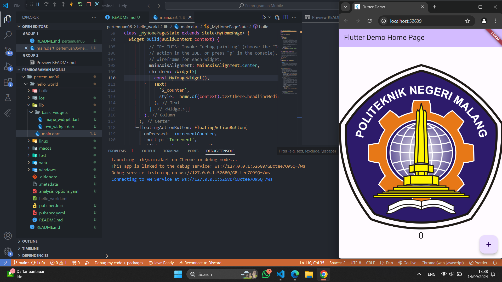

## This repository is belongs to

Muhammad Naufal Haidar Setyawan <br>
2241720097 / TI-3F <br>

### Praktikum 1: Membuat Project Flutter Baru

#### Langkah 1

Buka VS Code, lalu tekan tombol Ctrl + Shift + P maka akan tampil Command Palette, lalu ketik Flutter. Pilih New Application Project.

#### Langkah 2

Kemudian buat folder sesuai style laporan praktikum yang Anda pilih. Disarankan pada folder dokumen atau desktop atau alamat folder lain yang tidak terlalu dalam atau panjang. Lalu pilih Select a folder to create the project in.

#### Langkah 3

Buat nama project flutter hello_world seperti berikut, lalu tekan Enter. Tunggu hingga proses pembuatan project baru selesai.

#### Langkah 4

Jika sudah selesai proses pembuatan project baru, pastikan tampilan seperti berikut. Pesan akan tampil berupa "Your Flutter Project is ready!" artinya Anda telah berhasil membuat project Flutter baru.

**Jawab :** <br>


### Praktikum 2: Membuat Repository GitHub dan Laporan Praktikum

_Perhatian: Diasumsikan Anda telah mempunyai akun GitHub dan Anda telah memahami konsep dasar dalam bekerja menggunakan Git pada pertemuan pertama._

_Praktikum ini dapat Anda lewati langsung ke langkah 11 jika sudah paham cara membuat laporan praktikum sesuai style yang Anda pilih._

#### Langkah 11

Kembali ke VS Code, ubah platform di pojok kanan bawah ke emulator atau device atau bisa juga menggunakan browser Chrome. Lalu coba running project hello_world dengan tekan F5 atau Run > Start Debugging. Tunggu proses kompilasi hingga selesai, maka aplikasi flutter pertama Anda akan tampil seperti berikut.

**Jawab :** <br>


#### Langkah 12

Silakan screenshot seperti pada Langkah 11, namun teks yang ditampilkan dalam aplikasi berupa nama lengkap Anda. Simpan file screenshot dengan nama 01.png pada folder images (buat folder baru jika belum ada) di project hello_world Anda. Lalu ubah isi README.md seperti berikut, sehingga tampil hasil screenshot pada file README.md. Kemudian push ke repository Anda.

**Jawab :** <br>


### Praktikum 3: Menerapkan Widget Dasar

#### Langkah 1: Text Widget

Buat folder baru **basic_widgets** di dalam folder **lib**. Kemudian buat file baru di dalam basic_widgets dengan nama `text_widget.dart`. Ketik atau salin kode program berikut ke project hello_world Anda pada file `text_widget.dart`.

```
import 'package:flutter/material.dart';

class MyTextWidget extends StatelessWidget {
  const MyTextWidget({Key? key}) : super(key: key);

  @override
  Widget build(BuildContext context) {
    return const Text(
      "Nama saya Fulan, sedang belajar Pemrograman Mobile",
      style: TextStyle(color: Colors.red, fontSize: 14),
      textAlign: TextAlign.center);
  }
}
```

**Perhatian: Gantilah teks Fulan dengan nama lengkap Anda.**

Lakukan import file `text_widget.dart` ke main.dart, lalu ganti bagian text widget dengan kode di atas. Maka hasilnya seperti gambar berikut. Screenshot hasil milik Anda, lalu dibuat laporan pada file README.md.

**Jawab :** <br>

Sedikit tips, untuk membuat struktur **Stateless Widget** dapat dengan mengetikkan `stle` untuk memunculkan snippets. <br>

 <br>
 <br>
 <br>

#### Langkah 2: Image Widget

Buat sebuah file `image_widget.dart` di dalam folder basic_widgets dengan isi kode berikut.

```
import 'package:flutter/material.dart';

class MyImageWidget extends StatelessWidget {
  const MyImageWidget({Key? key}) : super(key: key);

  @override
  Widget build(BuildContext context) {
    return const Image(
      image: AssetImage("logo_polinema.jpg")
    );
  }
}
```

Lakukan penyesuaian asset pada file `pubspec.yaml` dan tambahkan file logo Anda di folder `assets` project hello_world.

```
flutter:
  assets:
     - logo_polinema.jpg
```

Jangan lupa sesuaikan kode dan import di file `main.dart` kemudian akan tampil gambar seperti berikut.

**Jawab :** <br>
Error saat menyimpan pubspec.yaml, karena file asset tidak ditemukan. Seharusnya saat kita menyimpan file asset di dalam folder `assets`, maka path yang benar harusnya seperti ini : <br>
 <br>
atau juga dapat dengan memberikan path folder agar seluruh file di dalam folder dapat terbaca, dengan **catatan** folder di dalam folder harus didaftarkan juga. <br>
 <br>
<br> `main.dart` : <br>

 <br>
 <br>

### Praktikum 4: Menerapkan Widget Material Design dan iOS Cupertino

#### Langkah 1: Cupertino Button dan Loading Bar

Buat file di basic_widgets > `loading_cupertino.dart`. Import stateless widget dari material dan cupertino. Lalu isi kode di dalam method Widget build adalah sebagai berikut.

```
return MaterialApp(
      home: Container(
        margin: const EdgeInsets.only(top: 30),
        color: Colors.white,
        child: Column(
          children: <Widget>[
            CupertinoButton(
              child: const Text("Contoh button"),
              onPressed: () {},
            ),
            const CupertinoActivityIndicator(),
          ],
        ),
      ),
    );
```

**Jawab :** <br>
 <br>

#### Langkah 2: Floating Action Button (FAB)

Button widget terdapat beberapa macam pada flutter yaitu ButtonBar, DropdownButton, TextButton, FloatingActionButton, IconButton, OutlineButton, PopupMenuButton, dan ElevatedButton.

Buat file di basic_widgets > `fab_widget.dart`. Import stateless widget dari material. Lalu isi kode di dalam method Widget build adalah sebagai berikut.

```
return MaterialApp(
      home: Scaffold(
        floatingActionButton: FloatingActionButton(
          onPressed: () {
            // Add your onPressed code here!
          },
          child: const Icon(Icons.thumb_up),
          backgroundColor: Colors.pink,
        ),
      ),
    );
```

**Jawab :** <br>
 <br>

#### Langkah 3: Scaffold Widget

Scaffold widget digunakan untuk mengatur tata letak sesuai dengan material design.

Ubah isi kode `main.dart` seperti berikut.

```
import 'package:flutter/material.dart';

void main() {
  runApp(const MyApp());
}

class MyApp extends StatelessWidget {
  const MyApp({Key? key}) : super(key: key);

  // This widget is the root of your application.
  @override
  Widget build(BuildContext context) {
    return MaterialApp(
      title: 'Flutter Demo',
      theme: ThemeData(
        primarySwatch: Colors.red,
      ),
      home: const MyHomePage(title: 'My Increment App'),
    );
  }
}

class MyHomePage extends StatefulWidget {
  const MyHomePage({Key? key, required this.title}) : super(key: key);

  final String title;

  @override
  State<MyHomePage> createState() => _MyHomePageState();
}

class _MyHomePageState extends State<MyHomePage> {
  int _counter = 0;

  void _incrementCounter() {
    setState(() {
      _counter++;
    });
  }

  @override
  Widget build(BuildContext context) {
    return Scaffold(
      appBar: AppBar(
        title: Text(widget.title),
      ),
      body: Center(
        child: Column(
          mainAxisAlignment: MainAxisAlignment.center,
          children: <Widget>[
            const Text(
              'You have pushed the button this many times:',
            ),
            Text(
              '$_counter',
              style: Theme.of(context).textTheme.headline4,
            ),
          ],
        ),
      ),
      bottomNavigationBar: BottomAppBar(
        child: Container(
          height: 50.0,
        ),
      ),
      floatingActionButton: FloatingActionButton(
        onPressed: _incrementCounter,
        tooltip: 'Increment Counter',
        child: const Icon(Icons.add),
      ),
      floatingActionButtonLocation: FloatingActionButtonLocation.centerDocked,
    );
  }
}
```

**Jawab :** <br>
 <br>

#### Langkah 4: Dialog Widget

Dialog widget pada flutter memiliki dua jenis dialog yaitu AlertDialog dan SimpleDialog.

Ubah isi kode `main.dart` seperti berikut.

```
class MyApp extends StatelessWidget {
  const MyApp({Key? key}) : super(key: key);

  @override
  Widget build(BuildContext context) {
    return const MaterialApp(
      home: Scaffold(
        body: MyLayout(),
      ),
    );
  }
}

class MyLayout extends StatelessWidget {
  const MyLayout({Key? key}) : super(key: key);

  @override
  Widget build(BuildContext context) {
    return Padding(
      padding: const EdgeInsets.all(8.0),
      child: ElevatedButton(
        child: const Text('Show alert'),
        onPressed: () {
          showAlertDialog(context);
        },
      ),
    );
  }
}

showAlertDialog(BuildContext context) {
  // set up the button
  Widget okButton = TextButton(
    child: const Text("OK"),
    onPressed: () {
      Navigator.pop(context);
    },
  );

  // set up the AlertDialog
  AlertDialog alert = AlertDialog(
    title: const Text("My title"),
    content: const Text("This is my message."),
    actions: [
      okButton,
    ],
  );

  // show the dialog
  showDialog(
    context: context,
    builder: (BuildContext context) {
      return alert;
    },
  );
}
```

**Jawab :** <br>
 <br>

#### Langkah 5: Input dan Selection Widget

Flutter menyediakan widget yang dapat menerima input dari pengguna aplikasi yaitu antara lain Checkbox, Date and Time Pickers, Radio Button, Slider, Switch, TextField.

Contoh penggunaan TextField widget adalah sebagai berikut:

```
class MyApp extends StatelessWidget {
  const MyApp({Key? key}) : super(key: key);

  @override
  Widget build(BuildContext context) {
    return MaterialApp(
      home: Scaffold(
        appBar: AppBar(title: const Text("Contoh TextField")),
        body: const TextField(
          obscureText: false,
          decoration: InputDecoration(
            border: OutlineInputBorder(),
            labelText: 'Nama',
          ),
        ),
      ),
    );
  }
}
```

**Jawab :** <br>
 <br>

#### Langkah 6: Date and Time Pickers

Date and Time Pickers termasuk pada kategori input dan selection widget, berikut adalah contoh penggunaan Date and Time Pickers.

```
import 'dart:async';
import 'package:flutter/material.dart';

void main() => runApp(const MyApp());

class MyApp extends StatelessWidget {
  const MyApp({Key? key}) : super(key: key);

  @override
  Widget build(BuildContext context) {
    return const MaterialApp(
      title: 'Contoh Date Picker',
      home: MyHomePage(title: 'Contoh Date Picker'),
    );
  }
}

class MyHomePage extends StatefulWidget {
  const MyHomePage({Key? key, required this.title}) : super(key: key);

  final String title;

  @override
  _MyHomePageState createState() => _MyHomePageState();
}

class _MyHomePageState extends State<MyHomePage> {
  // Variable/State untuk mengambil tanggal
  DateTime selectedDate = DateTime.now();

  //  Initial SelectDate FLutter
  Future<void> _selectDate(BuildContext context) async {
    // Initial DateTime FIinal Picked
    final DateTime? picked = await showDatePicker(
        context: context,
        initialDate: selectedDate,
        firstDate: DateTime(2015, 8),
        lastDate: DateTime(2101));
    if (picked != null && picked != selectedDate) {
      setState(() {
        selectedDate = picked;
      });
    }
  }

  @override
  Widget build(BuildContext context) {
    return Scaffold(
      appBar: AppBar(
        title: Text(widget.title),
      ),
      body: Center(
        child: Column(
          mainAxisSize: MainAxisSize.min,
          children: <Widget>[
            Text("${selectedDate.toLocal()}".split(' ')[0]),
            const SizedBox(
              height: 20.0,
            ),
            ElevatedButton(
              onPressed: () => {
                _selectDate(context),
                // ignore: avoid_print
                print(selectedDate.day + selectedDate.month + selectedDate.year)
              },
              child: const Text('Pilih Tanggal'),
            ),
          ],
        ),
      ),
    );
  }
}
```

**Jawab :** <br>
 <br>

### Tugas Praktikum

Selesaikan `Codelabs: Your first Flutter app`, lalu buatlah laporan praktikumnya dan push ke repository GitHub Anda!

#### Membuat proyek Flutter pertama Anda

Luncurkan Visual Studio Code dan buka palet perintah (dengan `F1` atau `Ctrl+Shift+P` atau `Shift+Cmd+P`). Ketik "flutter new". Pilih perintah **Flutter: New Project**.

<br>
<center></center>
<br>

Berikutnya, pilih **Application** lalu folder tempat proyek akan dibuat. Folder ini dapat berupa direktori utama Anda, atau direktori seperti `C:\src\`.

Terakhir, beri nama proyek Anda. Beri nama seperti `namer_app` atau `my_awesome_namer`.

 <br>

#### Menyalin & Menempelkan aplikasi awal

Pada panel sebelah kiri VS Code, pastikan bahwa **Penjelajah** dipilih lalu buka file `pubspec.yaml`

Ganti konten file ini dengan kode berikut:

**pubspec.yaml**

```dart
name: namer_app
description: A new Flutter project.

publish_to: 'none' # Remove this line if you wish to publish to pub.dev

version: 0.0.1+1

environment:
  sdk: '>=2.19.4 <4.0.0'

dependencies:
  flutter:
    sdk: flutter

  english_words: ^4.0.0
  provider: ^6.0.0

dev_dependencies:
  flutter_test:
    sdk: flutter

  flutter_lints: ^2.0.0

flutter:
  uses-material-design: true
```

 <br>

Berikutnya, buka file konfigurasi lainnya dalam proyek tersebut, `analysis_options.yaml`.

Ganti konten file tersebut dengan kode berikut:

**analysis_options.yaml**

```dart
include: package:flutter_lints/flutter.yaml

linter:
  rules:
    prefer_const_constructors: false
    prefer_final_fields: false
    use_key_in_widget_constructors: false
    prefer_const_literals_to_create_immutables: false
    prefer_const_constructors_in_immutables: false
    avoid_print: false
```

 <br>

Terakhir, buka file `main.dart` pada direktori `lib/`.

Ganti konten file ini dengan kode berikut:

```dart
import 'package:english_words/english_words.dart';
import 'package:flutter/material.dart';
import 'package:provider/provider.dart';

void main() {
  runApp(MyApp());
}

class MyApp extends StatelessWidget {
  const MyApp({super.key});

  @override
  Widget build(BuildContext context) {
    return ChangeNotifierProvider(
      create: (context) => MyAppState(),
      child: MaterialApp(
        title: 'Namer App',
        theme: ThemeData(
          useMaterial3: true,
          colorScheme: ColorScheme.fromSeed(seedColor: Colors.deepOrange),
        ),
        home: MyHomePage(),
      ),
    );
  }
}

class MyAppState extends ChangeNotifier {
  var current = WordPair.random();
}

class MyHomePage extends StatelessWidget {
  @override
  Widget build(BuildContext context) {
    var appState = context.watch<MyAppState>();

    return Scaffold(
      body: Column(
        children: [
          Text('A random idea:'),
          Text(appState.current.asLowerCase),
        ],
      ),
    );
  }
}
```

 <br>

#### Menambahkan tombol

Berikutnya, tambahkan tombol di bagian bawah `Column`, tepat di bawah instance `Text` kedua.

**lib/main.dart**

```dart
// ...

    return Scaffold(
      body: Column(
        children: [
          Text('A random AWESOME idea:'),
          Text(appState.current.asLowerCase),

          // ↓ Add this.
          ElevatedButton(
            onPressed: () {
              print('button pressed!');
            },
            child: Text('Next'),
          ),

        ],
      ),
    );

// ...
```

 <br>

#### Perilaku pertama Anda

Scroll ke MyAppState lalu tambahkan metode getNext.

**lib/main.dart**

```dart
// ...

class MyAppState extends ChangeNotifier {
  var current = WordPair.random();

  // ↓ Add this.
  void getNext() {
    current = WordPair.random();
    notifyListeners();
  }
}

// ...
```

Metode `getNext()` baru menetapkan ulang `current` dengan `WordPair` acak baru. Metode ini juga memanggil `notifyListeners()`(metode `ChangeNotifier`) yang memastikan bahwa semua orang yang melihat `MyAppState` diberi tahu.

Tindakan terakhir adalah memanggil metode `getNext` dari callback tombol tersebut.

**lib/main.dart**

```dart
// ...

    ElevatedButton(
      onPressed: () {
        appState.getNext();  // ← This instead of print().
      },
      child: Text('Next'),
    ),

// ...
```

Simpan dan uji coba aplikasi sekarang. Aplikasi akan menghasilkan pasangan kata acak baru setiap kali Anda menekan tombol **Next**.

 <br>

#### Mengekstrak widget

Tulis ulang widget `MyHomePage` sebagai berikut:

**lib/main.dart**

```dart
// ...

class MyHomePage extends StatelessWidget {
  @override
  Widget build(BuildContext context) {
    var appState = context.watch<MyAppState>();
    var pair = appState.current;                 // ← Add this.

    return Scaffold(
      body: Column(
        children: [
          Text('A random AWESOME idea:'),
          Text(pair.asLowerCase),                // ← Change to this.
          ElevatedButton(
            onPressed: () {
              appState.getNext();
            },
            child: Text('Next'),
          ),
        ],
      ),
    );
  }
}

// ...
```

Sekarang, panggil menu **Refactor**. Pada VS Code, Anda melakukan ini melalui salah satu dari dua cara:

1. Klik kanan potongan kode yang ingin Anda faktorkan ulang (dalam hal ini `Text`) dan pilih **Refactor...** dari menu drop-down,

ATAU

2. Pindahkan kursor Anda ke potongan kode yang ingin Anda faktorkan ulang (dalam hal ini, `Text`), lalu tekan `Ctrl+.` (Win/Linux) atau `Cmd+.` (Mac).

<br>
<center></center>
<br>

Pada menu **Refactor**, pilih **Extract Widget**. Tetapkan nama, seperti **BigCard**, lalu klik `Enter`.

Tindakan ini secara otomatis membuat class baru, `BigCard`, di akhir file saat ini. Class tersebut akan terlihat seperti berikut:

**lib/main.dart**

```dart
// ...

class BigCard extends StatelessWidget {
  const BigCard({
    super.key,
    required this.pair,
  });

  final WordPair pair;

  @override
  Widget build(BuildContext context) {
    return Text(pair.asLowerCase);
  }
}

// ...
```


#### Menambahkan Kartu

Temukan class `BigCard` dan metode `build()` yang berada di dalamnya. Sama seperti sebelumnya, panggil menu **Refactor** pada widget `Text`. Namun, kali ini Anda tidak akan mengekstrak widget.

Sebagai gantinya, pilih **Wrap with Padding**. Tindakan ini menciptakan widget induk baru di sekitar widget `Text` bernama `Padding`. Setelah menyimpannya, Anda akan melihat bahwa kata acak tersebut telah memiliki ruang yang lebih luas.

<br>
<center></center>
<br>

Tingkatkan padding dari nilai default `8.0`. Misalnya, gunakan `20` untuk padding yang lebih luas.

Berikutnya, mari kita naik satu tingkat lebih tinggi. Tempatkan kursor Anda pada widget `Padding`, buka menu **Refactor**, lalu pilih **Wrap with widget....**

Tindakan ini memungkinkan Anda untuk menentukan widget induk. Ketik "Card" dan tekan **Enter**.

<br>
<center></center>
<br>

Kode ini menggabungkan widget `Padding`, dan juga `Text`, dengan widget `Card`.


#### Tema dan gaya

Buat perubahan berikut untuk metode `build()` `BigCard`.

**lib/main.dart**

```dart
// ...

  @override
  Widget build(BuildContext context) {
    final theme = Theme.of(context);       // ← Add this.

    return Card(
      color: theme.colorScheme.primary,    // ← And also this.
      child: Padding(
        padding: const EdgeInsets.all(20),
        child: Text(pair.asLowerCase),
      ),
    );
  }

// ...
```


#### TextTheme

Kartu tersebut masih memiliki masalah: ukuran teks terlalu kecil dan warnanya membuat teks sulit dibaca. Untuk memperbaiki masalah ini, buat perubahan berikut pada metode `build()` `BigCard`.

**lib/main.dart**

```dart
// ...

  @override
  Widget build(BuildContext context) {
    final theme = Theme.of(context);
    // ↓ Add this.
    final style = theme.textTheme.displayMedium!.copyWith(
      color: theme.colorScheme.onPrimary,
    );

    return Card(
      color: theme.colorScheme.primary,
      child: Padding(
        padding: const EdgeInsets.all(20),
        // ↓ Change this line.
        child: Text(pair.asLowerCase, style: style),
      ),
    );
  }

// ...
```


#### Meningkatkan aksesibilitas

Gunakan properti `semanticsLabel` `Text` untuk mengganti konten visual widget teks dengan konten semantik yang lebih sesuai untuk pembaca layar:

**lib/main.dart**

```dart
// ...

  @override
  Widget build(BuildContext context) {
    final theme = Theme.of(context);
    final style = theme.textTheme.displayMedium!.copyWith(
      color: theme.colorScheme.onPrimary,
    );

    return Card(
      color: theme.colorScheme.primary,
      child: Padding(
        padding: const EdgeInsets.all(20),

        // ↓ Make the following change.
        child: Text(
          pair.asLowerCase,
          style: style,
          semanticsLabel: "${pair.first} ${pair.second}",
        ),
      ),
    );
  }

// ...
```


#### Menempatkan UI di tengah

Buka metode `build()` `MyHomePage`, dan buat perubahan berikut:

**lib/main.dart**

```dart
// ...

class MyHomePage extends StatelessWidget {
  @override
  Widget build(BuildContext context) {
    var appState = context.watch<MyAppState>();
    var pair = appState.current;

    return Scaffold(
      body: Column(
        mainAxisAlignment: MainAxisAlignment.center,  // ← Add this.
        children: [
          Text('A random AWESOME idea:'),
          BigCard(pair: pair),
          ElevatedButton(
            onPressed: () {
              appState.getNext();
            },
            child: Text('Next'),
          ),
        ],
      ),
    );
  }
}

// ...
```


Tindakan ini menempatkan turunan dalam `Column` di tengah pada sumbu utamanya (vertikal).
Turunan UI telah ditempatkan di tengah pada sumbu _silang_ kolom (dengan kata lain, turunan UI telah ditempatkan di tengah secara horizontal). Namun, `Column` itu sendiri tidak ditempatkan di tengah dalam `Scaffold`. Kita dapat memverifikasi ini menggunakan **Widget Inspector**.
Anda dapat menempatkan kolom itu sendiri di tengah. Letakkan kursor Anda di `Column`, buka menu **Refactor** (dengan `Ctrl+.` atau `Cmd+.`), lalu pilih **Wrap with Center**.

<br>
<center></center>
<br>

Kini, aplikasi akan terlihat seperti berikut:


Dengan perubahan opsional, `MyHomePage` mencakup kode berikut:

**lib/main.dart**

```dart
// ...

class MyHomePage extends StatelessWidget {
  @override
  Widget build(BuildContext context) {
    var appState = context.watch<MyAppState>();
    var pair = appState.current;

    return Scaffold(
      body: Center(
        child: Column(
          mainAxisAlignment: MainAxisAlignment.center,
          children: [
            BigCard(pair: pair),
            SizedBox(height: 10),
            ElevatedButton(
              onPressed: () {
                appState.getNext();
              },
              child: Text('Next'),
            ),
          ],
        ),
      ),
    );
  }
}

// ...
```

Aplikasinya akan terlihat seperti berikut:


#### Menambahkan logika bisnis

Scroll ke `MyAppState` dan tambahkan kode berikut:

**lib/main.dart**

```dart
// ...

class MyAppState extends ChangeNotifier {
  var current = WordPair.random();

  void getNext() {
    current = WordPair.random();
    notifyListeners();
  }

  // ↓ Add the code below.
  var favorites = <WordPair>[];

  void toggleFavorite() {
    if (favorites.contains(current)) {
      favorites.remove(current);
    } else {
      favorites.add(current);
    }
    notifyListeners();
  }
}

// ...
```


#### Menambahkan tombol

Pertama, gabungkan tombol yang ada pada `Row`. Buka metode `build()` `MyHomePage`, letakkan kursor pada `ElevatedButton`, buka menu **Refactor** dengan `Ctrl+.` atau `Cmd+.`, lalu pilih **Wrap with Row**.

<br>
<center></center>
<br>

Buat perubahan berikut:

**lib/main.dart**

```dart
// ...

class MyHomePage extends StatelessWidget {
  @override
  Widget build(BuildContext context) {
    var appState = context.watch<MyAppState>();
    var pair = appState.current;

    return Scaffold(
      body: Center(
        child: Column(
          mainAxisAlignment: MainAxisAlignment.center,
          children: [
            BigCard(pair: pair),
            SizedBox(height: 10),
            Row(
              mainAxisSize: MainAxisSize.min,   // ← Add this.
              children: [
                ElevatedButton(
                  onPressed: () {
                    appState.getNext();
                  },
                  child: Text('Next'),
                ),
              ],
            ),
          ],
        ),
      ),
    );
  }
}

// ...
```

Berikut satu cara untuk menambahkan tombol kedua untuk `MyHomePage`. Kali ini, gunakan konstruktor `ElevatedButton.icon()` untuk membuat tombol dengan ikon. Di bagian atas metode `build`, pilih ikon yang sesuai tergantung pada apakah pasangan kata saat ini sudah berada di favorit atau tidak. Selain itu, perhatikan penggunaan `SizedBox` lagi, untuk menjaga jarak antara kedua tombol.

**lib/main.dart**

```dart
// ...

class MyHomePage extends StatelessWidget {
  @override
  Widget build(BuildContext context) {
    var appState = context.watch<MyAppState>();
    var pair = appState.current;

    // ↓ Add this.
    IconData icon;
    if (appState.favorites.contains(pair)) {
      icon = Icons.favorite;
    } else {
      icon = Icons.favorite_border;
    }

    return Scaffold(
      body: Center(
        child: Column(
          mainAxisAlignment: MainAxisAlignment.center,
          children: [
            BigCard(pair: pair),
            SizedBox(height: 10),
            Row(
              mainAxisSize: MainAxisSize.min,
              children: [

                // ↓ And this.
                ElevatedButton.icon(
                  onPressed: () {
                    appState.toggleFavorite();
                  },
                  icon: Icon(icon),
                  label: Text('Like'),
                ),
                SizedBox(width: 10),

                ElevatedButton(
                  onPressed: () {
                    appState.getNext();
                  },
                  child: Text('Next'),
                ),
              ],
            ),
          ],
        ),
      ),
    );
  }
}

// ...
```

Aplikasi akan terlihat seperti berikut:


#### Menambahkan kolom samping navigasi

Untuk mencapai inti dari langkah ini secepat mungkin, pisahkan `MyHomePage` menjadi 2 widget terpisah.

Pilih keseluruhan `MyHomePage`, hapus, dan gantikan dengan kode berikut:

**lib/main.dart**

```dart
// ...

class MyHomePage extends StatelessWidget {
  @override
  Widget build(BuildContext context) {
    return Scaffold(
      body: Row(
        children: [
          SafeArea(
            child: NavigationRail(
              extended: false,
              destinations: [
                NavigationRailDestination(
                  icon: Icon(Icons.home),
                  label: Text('Home'),
                ),
                NavigationRailDestination(
                  icon: Icon(Icons.favorite),
                  label: Text('Favorites'),
                ),
              ],
              selectedIndex: 0,
              onDestinationSelected: (value) {
                print('selected: $value');
              },
            ),
          ),
          Expanded(
            child: Container(
              color: Theme.of(context).colorScheme.primaryContainer,
              child: GeneratorPage(),
            ),
          ),
        ],
      ),
    );
  }
}

class GeneratorPage extends StatelessWidget {
  @override
  Widget build(BuildContext context) {
    var appState = context.watch<MyAppState>();
    var pair = appState.current;

    IconData icon;
    if (appState.favorites.contains(pair)) {
      icon = Icons.favorite;
    } else {
      icon = Icons.favorite_border;
    }

    return Center(
      child: Column(
        mainAxisAlignment: MainAxisAlignment.center,
        children: [
          BigCard(pair: pair),
          SizedBox(height: 10),
          Row(
            mainAxisSize: MainAxisSize.min,
            children: [
              ElevatedButton.icon(
                onPressed: () {
                  appState.toggleFavorite();
                },
                icon: Icon(icon),
                label: Text('Like'),
              ),
              SizedBox(width: 10),
              ElevatedButton(
                onPressed: () {
                  appState.getNext();
                },
                child: Text('Next'),
              ),
            ],
          ),
        ],
      ),
    );
  }
}

// ...
```

Masukkan `StatefulWidget`, jenis widget yang memiliki `State`. Pertama, konversi `MyHomePage` menjadi widget stateful.

Tempatkan kursor Anda di baris pertama `MyHomePage` (baris yang diawali dengan `class MyHomePage...`), lalu buka menu **Refactor** menggunakan `Ctrl+.` atau `Cmd+.`. Kemudian, pilih **Convert to StatefulWidget**.

<br>
<center></center>
<br>


#### setState

Widget stateful baru hanya perlu melacak satu variabel: `selectedIndex`. Buat 3 perubahan berikut untuk `_MyHomePageState`:

**lib/main.dart**

```dart
// ...

class _MyHomePageState extends State<MyHomePage> {

  var selectedIndex = 0;     // ← Add this property.

  @override
  Widget build(BuildContext context) {
    return Scaffold(
      body: Row(
        children: [
          SafeArea(
            child: NavigationRail(
              extended: false,
              destinations: [
                NavigationRailDestination(
                  icon: Icon(Icons.home),
                  label: Text('Home'),
                ),
                NavigationRailDestination(
                  icon: Icon(Icons.favorite),
                  label: Text('Favorites'),
                ),
              ],
              selectedIndex: selectedIndex,    // ← Change to this.
              onDestinationSelected: (value) {

                // ↓ Replace print with this.
                setState(() {
                  selectedIndex = value;
                });

              },
            ),
          ),
          Expanded(
            child: Container(
              color: Theme.of(context).colorScheme.primaryContainer,
              child: GeneratorPage(),
            ),
          ),
        ],
      ),
    );
  }
}

// ...
```


#### Menggunakan selectedIndex

Tempatkan kode berikut di bagian atas metode `build _MyHomePageState`, tepat sebelum `return Scaffold`:

**lib/main.dart**

```dart
// ...

Widget page;
switch (selectedIndex) {
  case 0:
    page = GeneratorPage();
    break;
  case 1:
    page = Placeholder();
    break;
  default:
    throw UnimplementedError('no widget for $selectedIndex');
}

// ...
```

Kini, setelah `page` berisi widget yang ingin Anda tampilkan di sebelah kanan, Anda mungkin dapat menebak perubahan apa lagi yang diperlukan.

Berikut tampilan `_MyHomePageState` setelah satu perubahan tersebut:

**lib/main.dart**

```dart
// ...

class _MyHomePageState extends State<MyHomePage> {
  var selectedIndex = 0;

  @override
  Widget build(BuildContext context) {
    Widget page;
    switch (selectedIndex) {
      case 0:
        page = GeneratorPage();
        break;
      case 1:
        page = Placeholder();
        break;
      default:
        throw UnimplementedError('no widget for $selectedIndex');
    }

    return Scaffold(
      body: Row(
        children: [
          SafeArea(
            child: NavigationRail(
              extended: false,
              destinations: [
                NavigationRailDestination(
                  icon: Icon(Icons.home),
                  label: Text('Home'),
                ),
                NavigationRailDestination(
                  icon: Icon(Icons.favorite),
                  label: Text('Favorites'),
                ),
              ],
              selectedIndex: selectedIndex,
              onDestinationSelected: (value) {
                setState(() {
                  selectedIndex = value;
                });
              },
            ),
          ),
          Expanded(
            child: Container(
              color: Theme.of(context).colorScheme.primaryContainer,
              child: page,  // ← Here.
            ),
          ),
        ],
      ),
    );
  }
}

// ...
```

Aplikasi sekarang beralih di antara `GeneratorPage` kita dan placeholder yang akan segera menjadi halaman **Favorites**.


#### Tingkat respons

Berikutnya, buat kolom samping navigasi menjadi responsif. Dengan kata lain, buat agar kolom samping navigasi menampilkan label secara otomatis (menggunakan `extended: true`) saat ada ruang yang cukup.

Dalam hal ini, widget yang digunakan adalah `LayoutBuilder`. Widget ini memungkinkan Anda mengubah pohon widget tergantung pada seberapa banyak ruang yang tersedia yang dimiliki.

Sekali lagi, gunakan menu **Refactor** Flutter di VS Code untuk membuat perubahan yang diperlukan. Namun, proses kali ini sedikit lebih rumit:

1. Dalam metode `build _MyHomePageState`, letakkan kursor Anda pada `Scaffold`.
2. Buka menu **Refactor** dengan `Ctrl+.` (Windows/Linux) atau `Cmd+.` (Mac).
3. Pilih **Wrap with Builder** dan tekan **Enter**.
4. Modifikasi nama `Builder` yang baru ditambahkan menjadi `LayoutBuilder`.
5. Modifikasi daftar parameter callback dari `(context)` menjadi `(context, constraints)`.

<br>
<center></center>
<br>

Sekarang kode Anda dapat memutuskan untuk menampilkan label dengan membuat kueri `constraints` saat ini atau tidak. Buat perubahan baris tunggal berikut untuk metode `build _MyHomePageState`:

**lib/main.dart**

```dart
// ...

class _MyHomePageState extends State<MyHomePage> {
  var selectedIndex = 0;

  @override
  Widget build(BuildContext context) {
    Widget page;
    switch (selectedIndex) {
      case 0:
        page = GeneratorPage();
        break;
      case 1:
        page = Placeholder();
        break;
      default:
        throw UnimplementedError('no widget for $selectedIndex');
    }

    return LayoutBuilder(builder: (context, constraints) {
      return Scaffold(
        body: Row(
          children: [
            SafeArea(
              child: NavigationRail(
                extended: constraints.maxWidth >= 600,  // ← Here.
                destinations: [
                  NavigationRailDestination(
                    icon: Icon(Icons.home),
                    label: Text('Home'),
                  ),
                  NavigationRailDestination(
                    icon: Icon(Icons.favorite),
                    label: Text('Favorites'),
                  ),
                ],
                selectedIndex: selectedIndex,
                onDestinationSelected: (value) {
                  setState(() {
                    selectedIndex = value;
                  });
                },
              ),
            ),
            Expanded(
              child: Container(
                color: Theme.of(context).colorScheme.primaryContainer,
                child: page,
              ),
            ),
          ],
        ),
      );
    });
  }
}

// ...
```

Sekarang aplikasi Anda merespons lingkungannya, seperti ukuran layar, orientasi, dan platform. Dengan kata lain, aplikasi Anda sudah responsif.

 <br>


#### Menambahkan halaman baru

Anda ingat widget `Placeholder` yang kita gunakan sebagai ganti halaman **Favorites**?

Berikut ini hanyalah _salah satu_ cara untuk menerapkan halaman favorit. Bagaimana halaman ini diterapkan (semoga) akan menginspirasi Anda untuk bermain dengan kode—meningkatkan UI dan membuat UI sesuai keinginan Anda.

Berikut class `FavoritesPage` baru:

**lib/main.dart**

```dart
// ...

class FavoritesPage extends StatelessWidget {
  @override
  Widget build(BuildContext context) {
    var appState = context.watch<MyAppState>();

    if (appState.favorites.isEmpty) {
      return Center(
        child: Text('No favorites yet.'),
      );
    }

    return ListView(
      children: [
        Padding(
          padding: const EdgeInsets.all(20),
          child: Text('You have '
              '${appState.favorites.length} favorites:'),
        ),
        for (var pair in appState.favorites)
          ListTile(
            leading: Icon(Icons.favorite),
            title: Text(pair.asLowerCase),
          ),
      ],
    );
  }
}
```


