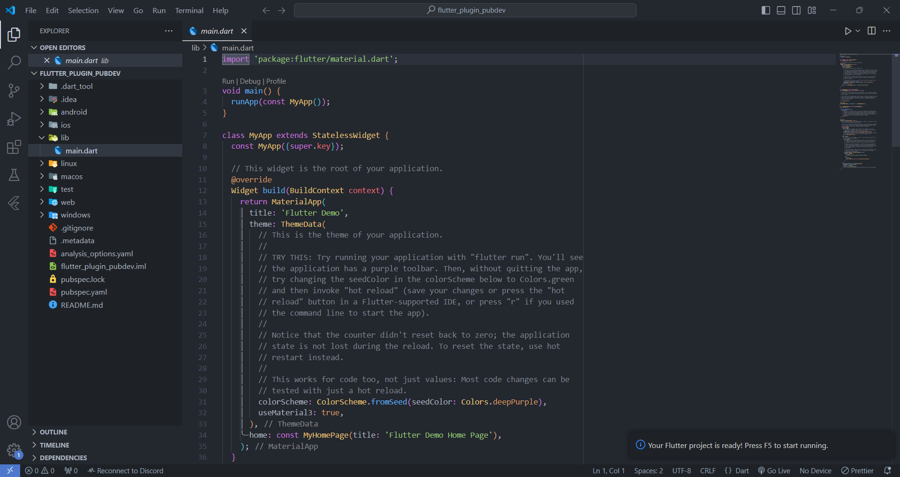
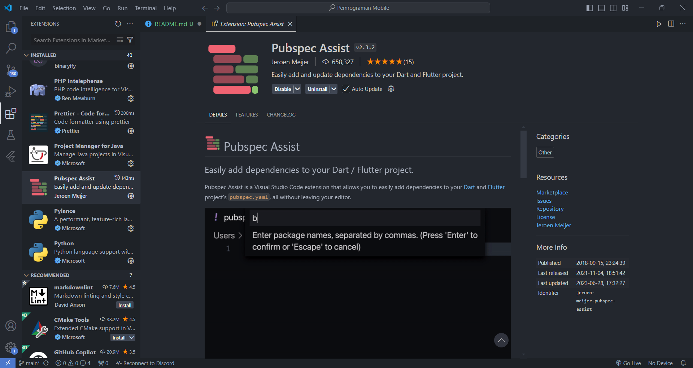
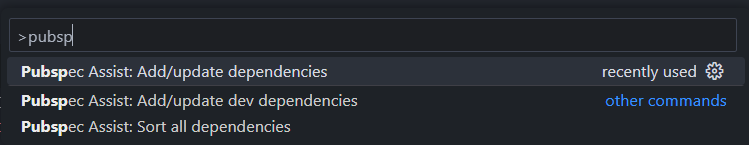
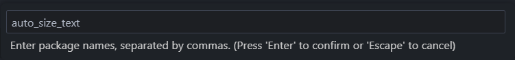
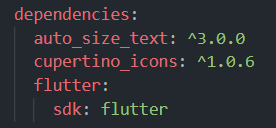
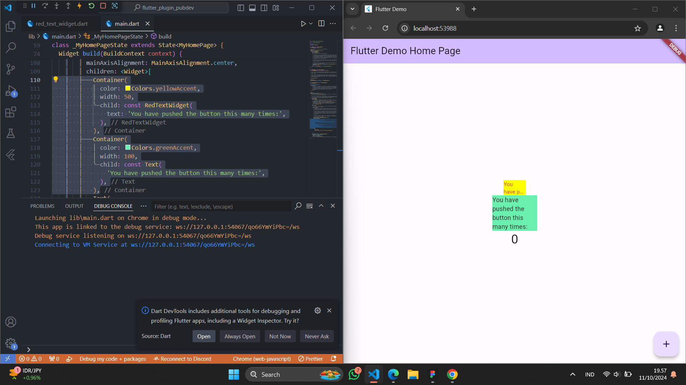

## This repository is belongs to

Muhammad Naufal Haidar Setyawan <br>
2241720097 / TI-3F <br>

### Praktikum Menerapkan Plugin di Project Flutter

#### Langkah 1: Buat Project Baru

Buatlah sebuah project flutter baru dengan nama **flutter_plugin_pubdev**. Lalu jadikan repository di GitHub Anda dengan nama **flutter_plugin_pubdev**.

**Jawab :** <br>


#### Langkah 2: Menambahkan Plugin

Tambahkan plugin `auto_size_text` menggunakan perintah berikut di terminal

```
flutter pub add auto_size_text
```

Jika berhasil, maka akan tampil nama plugin beserta versinya di file `pubspec.yaml` pada bagian dependencies.

**Jawab :** <br>
Ada cara yang lebih mudah, yakni dengan extension `Pubspec Assist` di VS Code. <br>
 <br>
Cara penggunaannya, yakni dengan memunculkan `Command Palette` (Windows tekan `Ctrl + Shift + P`), lalu cari dengan keyword `pubspec` <br>
 <br>
Kemudian inputkan package yang ada di `pub.dev` yang ingin digunakan <br>
 <br>
Kelebihannya adalah, package di dalam `pubspec.yaml` akan diurutkan otomatis secara alphabetical <br>
 <br>

#### Langkah 3: Buat file `red_text_widget.dart`

Buat file baru bernama `red_text_widget.dart` di dalam folder lib lalu isi kode seperti berikut.

```dart
import 'package:flutter/material.dart';

class RedTextWidget extends StatelessWidget {
  const RedTextWidget({Key? key}) : super(key: key);

  @override
  Widget build(BuildContext context) {
    return Container();
  }
}
```

#### Langkah 4: Tambah Widget AutoSizeText

Masih di file `red_text_widget.dart`, untuk menggunakan plugin `auto_size_text`, ubahlah kode `return Container()` menjadi seperti berikut.

```dart
return AutoSizeText(
      text,
      style: const TextStyle(color: Colors.red, fontSize: 14),
      maxLines: 2,
      overflow: TextOverflow.ellipsis,
);
```

Setelah Anda menambahkan kode di atas, Anda akan mendapatkan info error. Mengapa demikian? Jelaskan dalam laporan praktikum Anda!

**Jawab :** <br>
Error: Undefined name 'text'. Try correcting the name to one that is defined, or defining the name. <br>
Itu karena variabel `text` tidak pernah ada sebelumnya, sehingga tidak dapat dipanggil di dalam widget `AutoSizeText`.

#### Langkah 5: Buat Variabel text dan parameter di constructor

Tambahkan variabel `text` dan parameter di constructor seperti berikut.

```dart
final String text;

const RedTextWidget({Key? key, required this.text}) : super(key: key);
```

#### Langkah 6: Tambahkan widget di main.dart

Buka file `main.dart` lalu tambahkan di dalam `children:` pada `class _MyHomePageState`

```dart
Container(
   color: Colors.yellowAccent,
   width: 50,
   child: const RedTextWidget(
             text: 'You have pushed the button this many times:',
          ),
),
Container(
    color: Colors.greenAccent,
    width: 100,
    child: const Text(
           'You have pushed the button this many times:',
          ),
),
```

**Jawab :** <br>
 <br>

### Tugas Praktikum

1. Jelaskan maksud dari langkah 2 pada praktikum tersebut! <br>
   **Jawab :** <br>
   Perintah `flutter pub add auto_size_text` adalah perintah untuk menambahkan package `auto_size_text` yang berasal dari `pub.dev` ke dalam project. Flutter akan menambahkan `auto_size_text` ke dalam daftar dependencies pada `pubspec.yaml`, lalu kemudian akan melakukan `flutter pub get` secara otomatis sebagai perintah untuk mendownload package yang dibutuhkan.
2. Jelaskan maksud dari langkah 5 pada praktikum tersebut! <br>
   **Jawab :** <br>
   Menambahkan variabel `text` sebagai parameter dari `RedTextWidget`. Hal ini berarti saat `RedTextWidget` dipanggil, maka membutuhkan variabel `text` untuk dikirim.
3. Pada langkah 6 terdapat dua widget yang ditambahkan, jelaskan fungsi dan perbedaannya! <br>
   **Jawab :** <br>
   `Container` pertama memiliki warna **Yellow Accent** dan text yang berada pada child akan diresize agar muat dalam ukuran panjang 50. Sedangkan `Container` kedua memiliki warna **Green Accent** dan text yang berada pada child akan diresize agar muat dalam ukuran panjang 100.
4. Jelaskan maksud dari tiap parameter yang ada di dalam plugin `auto_size_text` berdasarkan tautan pada dokumentasi [ini](https://pub.dev/documentation/auto_size_text/latest/) ! <br>
   **Jawab :** <br>

   <ul>
    <li><b>key</b>: Mengontrol bagaimana widget menggantikan widget lain di dalam pohon.</li>
    <li><b>textKey</b>: Menetapkan kunci untuk widget Teks yang dihasilkan.</li>
    <li><b>style</b>: Jika tidak null, gaya yang digunakan untuk teks ini.</li>
    <li><b>minFontSize</b>: Batas ukuran teks minimum yang akan digunakan saat mengubah ukuran teks secara otomatis.</li>
    <li><b>maxFontSize</b>: Batas ukuran teks maksimum yang akan digunakan saat mengubah ukuran teks secara otomatis.</li>
    <li><b>stepGranularity</b>: Ukuran langkah di mana ukuran font diadaptasi ke batasan.</li>
    <li><b>presetFontSizes</b>: Menentukan semua ukuran font yang mungkin. Penting: presetFontSizes harus dalam urutan menurun.</li>
    <li><b>group</b>: Mensinkronkan ukuran beberapa AutoSizeText.</li>
    <li><b>textAlign</b>: Cara teks harus disejajarkan secara horizontal.</li>
    <li><b>textDirection</b>: Arah teks. Ini menentukan bagaimana nilai textAlign seperti TextAlign.start dan TextAlign.end diinterpretasikan.</li>
    <li><b>locale</b>: Digunakan untuk memilih font ketika karakter Unicode yang sama dapat dirender secara berbeda, tergantung pada lokasinya.</li>
    <li><b>softWrap</b>: Apakah teks harus dipecah pada titik pemutusan baris lunak.</li>
    <li><b>wrapWords</b>: Apakah kata-kata yang tidak cocok dalam satu baris harus dibungkus. Defaultnya adalah true untuk berperilaku seperti Text.</li>
    <li><b>overflow</b>: Cara menangani overflow visual.</li>
    <li><b>overflowReplacement</b>: Jika teks meluap dan tidak cocok dengan batasnya, widget ini akan ditampilkan sebagai gantinya.</li>
    <li><b>textScaleFactor</b>: Jumlah piksel font untuk setiap piksel logis. Juga mempengaruhi minFontSize, maxFontSize, dan presetFontSizes.</li>
    <li><b>maxLines</b>: Jumlah maksimum baris opsional untuk teks untuk direntang.</li>
    <li><b>semanticsLabel</b>: Label semantik alternatif untuk teks ini.</li>
    </ul>
