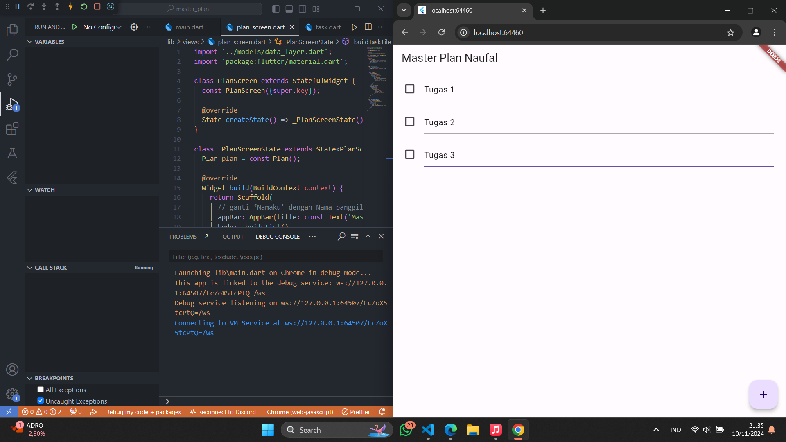
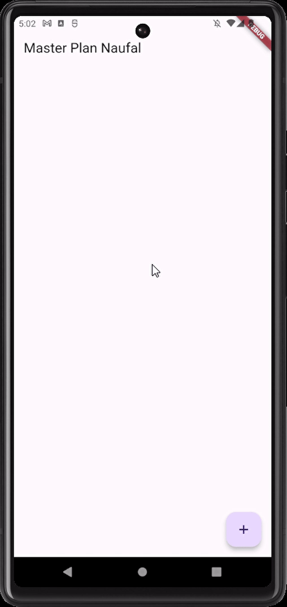
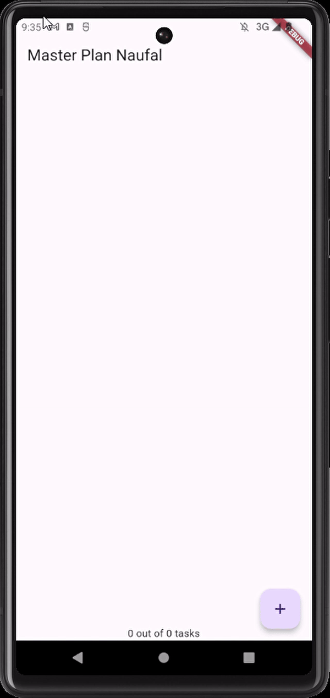
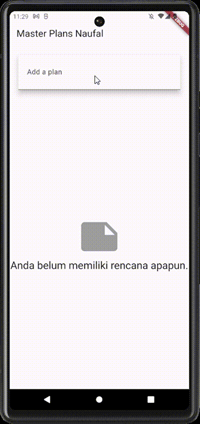

## This repository is belongs to

Muhammad Naufal Haidar Setyawan <br>
2241720097 / TI-3F <br>

### Praktikum 1: Dasar State dengan Model-View

#### Langkah 1: Buat Project Baru

Buatlah sebuah project flutter baru dengan nama **master_plan** di folder **src week-10** repository GitHub Anda atau sesuai style laporan praktikum yang telah disepakati. Lalu buatlah susunan folder dalam project seperti gambar berikut ini. <br>

 <br>

#### Langkah 2: Membuat model `task.dart`

Praktik terbaik untuk memulai adalah pada lapisan data (_data layer_). Ini akan memberi Anda gambaran yang jelas tentang aplikasi Anda, tanpa masuk ke detail antarmuka pengguna Anda. Di folder model, buat file bernama `task.dart` dan buat `class Task`. Class ini memiliki atribut `description` dengan tipe data String dan `complete` dengan tipe data Boolean, serta ada konstruktor. Kelas ini akan menyimpan data tugas untuk aplikasi kita. Tambahkan kode berikut:

```dart
class Task {
  final String description;
  final bool complete;

  const Task({
    this.complete = false,
    this.description = '',
  });
}
```

#### Langkah 3: Buat file `plan.dart`

Kita juga perlu sebuah List untuk menyimpan daftar rencana dalam aplikasi to-do ini. Buat file `plan.dart` di dalam folder **models** dan isi kode seperti berikut.

```dart
import './task.dart';

class Plan {
  final String name;
  final List<Task> tasks;

  const Plan({this.name = '', this.tasks = const []});
}
```

#### Langkah 4: Buat file `data_layer.dart`

Kita dapat membungkus beberapa data layer ke dalam sebuah file yang nanti akan mengekspor kedua model tersebut. Dengan begitu, proses impor akan lebih ringkas seiring berkembangnya aplikasi. Buat file bernama `data_layer.dart` di folder **models**. Kodenya hanya berisi `export` seperti berikut.

```
export 'plan.dart';
export 'task.dart';
```

#### Langkah 5: Pindah ke file `main.dart`

Ubah isi kode `main.dart` sebagai berikut.

```dart
import 'package:flutter/material.dart';
import './views/plan_screen.dart';

void main() => runApp(MasterPlanApp());

class MasterPlanApp extends StatelessWidget {
  const MasterPlanApp({super.key});

  @override
  Widget build(BuildContext context) {
    return MaterialApp(
     theme: ThemeData(primarySwatch: Colors.purple),
     home: PlanScreen(),
    );
  }
}
```

#### Langkah 6: buat `plan_screen.dart`

Pada folder `views`, buatlah sebuah file `plan_screen.dart` dan gunakan templat `StatefulWidget` untuk membuat `class PlanScreen`. Isi kodenya adalah sebagai berikut. Gantilah teks **‘Namaku'** dengan nama panggilan Anda pada `title AppBar`.

```dart
import '../models/data_layer.dart';
import 'package:flutter/material.dart';

class PlanScreen extends StatefulWidget {
  const PlanScreen({super.key});

  @override
  State createState() => _PlanScreenState();
}

class _PlanScreenState extends State<PlanScreen> {
  Plan plan = const Plan();

  @override
  Widget build(BuildContext context) {
   return Scaffold(
    // ganti ‘Namaku' dengan Nama panggilan Anda
    appBar: AppBar(title: const Text('Master Plan Namaku')),
    body: _buildList(),
    floatingActionButton: _buildAddTaskButton(),
   );
  }
}
```

#### Langkah 7: buat method `_buildAddTaskButton()`

Anda akan melihat beberapa error di langkah 6, karena method yang belum dibuat. Ayo kita buat mulai dari yang paling mudah yaitu tombol **Tambah Rencana**. Tambah kode berikut di bawah method `build` di dalam class `_PlanScreenState`.

```dart
Widget _buildAddTaskButton() {
  return FloatingActionButton(
   child: const Icon(Icons.add),
   onPressed: () {
     setState(() {
      plan = Plan(
       name: plan.name,
       tasks: List<Task>.from(plan.tasks)
       ..add(const Task()),
     );
    });
   },
  );
}
```

#### Langkah 8: buat widget `_buildList()`

Kita akan buat widget berupa `List` yang dapat dilakukan scroll, yaitu `ListView.builder`. Buat widget `ListView` seperti kode berikut ini.

```dart
Widget _buildList() {
  return ListView.builder(
   itemCount: plan.tasks.length,
   itemBuilder: (context, index) =>
   _buildTaskTile(plan.tasks[index], index),
  );
}
```

#### Langkah 9: buat widget `_buildTaskTile`

Dari langkah 8, kita butuh `ListTile` untuk menampilkan setiap nilai dari `plan.tasks`. Kita buat dinamis untuk setiap `index` data, sehingga membuat `view` menjadi lebih mudah. Tambahkan kode berikut ini.

```dart
Widget _buildTaskTile(Task task, int index) {
    return ListTile(
      leading: Checkbox(
          value: task.complete,
          onChanged: (selected) {
            setState(() {
              plan = Plan(
                name: plan.name,
                tasks: List<Task>.from(plan.tasks)
                  ..[index] = Task(
                    description: task.description,
                    complete: selected ?? false,
                  ),
              );
            });
          }),
      title: TextFormField(
        initialValue: task.description,
        onChanged: (text) {
          setState(() {
            plan = Plan(
              name: plan.name,
              tasks: List<Task>.from(plan.tasks)
                ..[index] = Task(
                  description: text,
                  complete: task.complete,
                ),
            );
          });
        },
      ),
    );
  }
```

**Run** atau tekan **F5** untuk melihat hasil aplikasi yang Anda telah buat. Capture hasilnya untuk soal praktikum nomor 4. <br>

**Jawab :** <br>


#### Langkah 10: Tambah Scroll Controller

Anda dapat menambah tugas sebanyak-banyaknya, menandainya jika sudah beres, dan melakukan scroll jika sudah semakin banyak isinya. Namun, ada salah satu fitur tertentu di iOS perlu kita tambahkan. Ketika keyboard tampil, Anda akan kesulitan untuk mengisi yang paling bawah. Untuk mengatasi itu, Anda dapat menggunakan `ScrollController` untuk menghapus focus dari semua `TextField` selama event scroll dilakukan. Pada file `plan_screen.dart`, tambahkan variabel scroll controller di class State tepat setelah variabel `plan`.

```dart
late ScrollController scrollController;
```

#### Langkah 11: Tambah Scroll Listener

Tambahkan method `initState()` setelah deklarasi variabel `scrollController` seperti kode berikut.

```dart
@override
void initState() {
  super.initState();
  scrollController = ScrollController()
    ..addListener(() {
      FocusScope.of(context).requestFocus(FocusNode());
    });
}
```

#### Langkah 12: Tambah controller dan keyboard behavior

Tambahkan controller dan keyboard behavior pada ListView di method `_buildList` seperti kode berikut ini.

```dart
return ListView.builder(
  controller: scrollController,
 keyboardDismissBehavior: Theme.of(context).platform ==
 TargetPlatform.iOS
          ? ScrollViewKeyboardDismissBehavior.onDrag
          : ScrollViewKeyboardDismissBehavior.manual,
```

#### Langkah 13: Terakhir, tambah method dispose()

Terakhir, tambahkan method `dispose()` berguna ketika widget sudah tidak digunakan lagi.

```dart
@override
void dispose() {
  scrollController.dispose();
  super.dispose();
}
```

#### Langkah 14: Hasil

Lakukan Hot restart (**bukan** hot reload) pada aplikasi Flutter Anda. Anda akan melihat tampilan akhir seperti gambar berikut. Jika masih terdapat error, silakan diperbaiki hingga bisa running.


> **Catatan**: Kedua fitur hot reload dan hot restart memiliki performa lebih cepat dibanding melakukan build ulang secara keseluruhan aplikasi. Secara umum:
>
> <li>Gunakan hot reload untuk melihat perubahan pada tampilan UI, jadi perubahan paling banyak terjadi di metode build. State pada aplikasi tetap dipertahankan dan Anda akan melihat perubahannya hampir secara instan.</li>
> <li>Gunakan hot restart untuk melihat perubahan pada state aplikasi, seperti memperbarui variabel global, static fields, atau metode main(). Kondisi app state akan reset (kembali seperti awal).</li>

### Tugas Praktikum 1: Dasar State dengan Model-View

1. Jelaskan maksud dari langkah 4 pada praktikum tersebut! Mengapa dilakukan demikian? <br>
   **Jawab :** <br>
   Agar proses `import` pada beberapa model dapat menjadi lebih ringkas dengan mengimport `data_layer.dart` saja.
2. Mengapa perlu variabel plan di langkah 6 pada praktikum tersebut? Mengapa dibuat konstanta ? <br>
   **Jawab :** <br>
   Variabel plan digunakan untuk menyimpan state model `Plan`.`Plan` sendiri sepertinya adalah sebuah model data yang berisi nama rencana dan daftar tugas (tasks). Variabel ini diperlukan agar widget dapat mengelola dan memperbarui data rencana secara reaktif. Ketika ada perubahan pada plan (misalnya saat menambah task baru), widget akan di-rebuild untuk menampilkan data terbaru. <br>
   **Mengapa dibuat konstanta?** `const` pada inisialisasi awal hanya untuk optimasi. Variabel `plan` sendiri tidak final/const karena nilainya akan diubah kemudian saat menambahkan plan baru.
3. Lakukan capture hasil dari Langkah 9 berupa GIF, kemudian jelaskan apa yang telah Anda buat! <br>
   **Jawab :** <br>
    <br>
   Membuat aplikasi to-do list tanpa menerapkan state management (hanya menggunakan setState biasa saja).
4. Apa kegunaan method pada Langkah 11 dan 13 dalam lifecyle state ? <br>
   **Jawab :** <br>
   `initState()` dipanggil saat widget StatefulWidget pertama kali dibuat, digunakan untuk melakukan inisialisasi yang diperlukan sebelum widget dibangun (hanya dipanggil sekali dalam lifecycle widget). Dalam kode di atas, digunakan untuk menginisialisasi scrollController lalu menambahkan listener pada scrollController untuk menutup keyboard (unfocus) saat scrolling terjadi. <br>
   Sedangkan `dispose()` dipanggil saat widget dihapus dari widget tree secara permanen, digunakan untuk membersihkan resources/memory yang tidak lagi diperlukan. Hal ini penting untuk mencegah memory leak. Dalam kode di atas digunakan untuk membersihkan scrollController agar tidak memakan memori.

### Praktikum 2: Mengelola Data Layer dengan InheritedWidget dan InheritedNotifier

#### Langkah 1: Buat file `plan_provider.dart`

Buat folder baru `provider` di dalam folder `lib`, lalu buat file baru dengan nama `plan_provider.dart` berisi kode seperti berikut.

```dart
import 'package:flutter/material.dart';
import '../models/data_layer.dart';

class PlanProvider extends InheritedNotifier<ValueNotifier<Plan>> {
  const PlanProvider({super.key, required Widget child, required
   ValueNotifier<Plan> notifier})
  : super(child: child, notifier: notifier);

  static ValueNotifier<Plan> of(BuildContext context) {
   return context.
    dependOnInheritedWidgetOfExactType<PlanProvider>()!.notifier!;
  }
}
```

#### Langkah 2: Edit `main.dart`

Gantilah pada bagian atribut `home` dengan `PlanProvider` seperti berikut. Jangan lupa sesuaikan bagian impor jika dibutuhkan.

```dart
return MaterialApp(
  theme: ThemeData(primarySwatch: Colors.purple),
  home: PlanProvider(
    notifier: ValueNotifier<Plan>(const Plan()),
    child: const PlanScreen(),
   ),
);
```

#### Langkah 3: Tambah method pada model `plan.dart`

Tambahkan dua method di dalam model `class Plan` seperti kode berikut.

```dart
int get completedCount => tasks
  .where((task) => task.complete)
  .length;

String get completenessMessage =>
  '$completedCount out of ${tasks.length} tasks';
```

#### Langkah 4: Pindah ke PlanScreen

Edit `PlanScreen` agar menggunakan data dari `PlanProvider`. Hapus deklarasi variabel `plan` (ini akan membuat error). Kita akan perbaiki pada langkah 5 berikut ini.

#### Langkah 5: Edit method `_buildAddTaskButton`

Tambahkan `BuildContext` sebagai parameter dan gunakan `PlanProvider` sebagai sumber datanya. Edit bagian kode seperti berikut.

```dart
Widget _buildAddTaskButton(BuildContext context) {
  ValueNotifier<Plan> planNotifier = PlanProvider.of(context);
  return FloatingActionButton(
    child: const Icon(Icons.add),
    onPressed: () {
      Plan currentPlan = planNotifier.value;
      planNotifier.value = Plan(
        name: currentPlan.name,
        tasks: List<Task>.from(currentPlan.tasks)..add(const Task()),
      );
    },
  );
}
```

#### Langkah 6: Edit method `_buildTaskTile`

Tambahkan parameter `BuildContext`, gunakan `PlanProvider` sebagai sumber data. Ganti `TextField` menjadi `TextFormField` untuk membuat inisial `data provider` menjadi lebih mudah.

```dart
Widget _buildTaskTile(Task task, int index, BuildContext context) {
  ValueNotifier<Plan> planNotifier = PlanProvider.of(context);
  return ListTile(
    leading: Checkbox(
       value: task.complete,
       onChanged: (selected) {
         Plan currentPlan = planNotifier.value;
         planNotifier.value = Plan(
           name: currentPlan.name,
           tasks: List<Task>.from(currentPlan.tasks)
             ..[index] = Task(
               description: task.description,
               complete: selected ?? false,
             ),
         );
       }),
    title: TextFormField(
      initialValue: task.description,
      onChanged: (text) {
        Plan currentPlan = planNotifier.value;
        planNotifier.value = Plan(
          name: currentPlan.name,
          tasks: List<Task>.from(currentPlan.tasks)
            ..[index] = Task(
              description: text,
              complete: task.complete,
            ),
        );
      },
    ),
  );
}
```

#### Langkah 7: Edit `_buildList`

Sesuaikan parameter pada bagian `_buildTaskTile` seperti kode berikut.

```dart
Widget _buildList(Plan plan) {
   return ListView.builder(
     controller: scrollController,
     itemCount: plan.tasks.length,
     itemBuilder: (context, index) =>
        _buildTaskTile(plan.tasks[index], index, context),
   );
}
```

#### Langkah 8: Tetap di `class PlanScreen`

Edit method build sehingga bisa tampil progress pada bagian bawah (footer). Caranya, bungkus (wrap) \_buildList dengan widget Expanded dan masukkan ke dalam widget Column seperti kode pada Langkah 9.

#### Langkah 9: Tambah widget `SafeArea`

Terakhir, tambahkan widget `SafeArea` dengan berisi `completenessMessage` pada akhir widget `Column`. Perhatikan kode berikut ini.

```dart
@override
Widget build(BuildContext context) {
   return Scaffold(
     appBar: AppBar(title: const Text('Master Plan')),
     body: ValueListenableBuilder<Plan>(
       valueListenable: PlanProvider.of(context),
       builder: (context, plan, child) {
         return Column(
           children: [
             Expanded(child: _buildList(plan)),
             SafeArea(child: Text(plan.completenessMessage))
           ],
         );
       },
     ),
     floatingActionButton: _buildAddTaskButton(context),
   );
}
```

Akhirnya, **run** atau tekan **F5** jika aplikasi belum running. Tidak akan terlihat perubahan pada UI, namun dengan melakukan langkah-langkah di atas, Anda telah menerapkan cara memisahkan dengan baik antara **view** dan **model**. Ini merupakan hal terpenting dalam mengelola **state** di aplikasi Anda.

### Tugas Praktikum 2: InheritedWidget

1. Jelaskan mana yang dimaksud InheritedWidget pada langkah 1 tersebut! Mengapa yang digunakan InheritedNotifier? <br>
   **Jawab :** <br>
   **InheritedWidget** adalah salah satu widget khusus di Flutter yang digunakan untuk memudahkan penyebaran data ke seluruh widget tree. InheritedWidget menyediakan mekanisme untuk "mewariskan" data ke widget-widget yang berada di bawahnya dalam widget tree.
   Widget yang ingin mengakses data yang dimiliki oleh InheritedWidget dapat melakukannya dengan memanggil `dependOnInheritedWidgetOfExactType()`. <br>
   Sedangkan **InheritedNotifier** adalah subclass dari InheritedWidget yang menambahkan fungsionalitas untuk notifikasi perubahan data. <br>

   Dalam kode di atas, **PlanProvider** merupakan subclass dari InheritedNotifier. Tujuan penggunaan InheritedNotifier di sini adalah agar perubahan data pada Plan dapat dinotifikasikan ke widget-widget yang bergantung padanya.
   Ketika data Plan berubah, InheritedNotifier akan memberitahu widget-widget yang terdaftar sebagai listener, sehingga mereka dapat melakukan re-render dan menampilkan data terbaru.

2. Jelaskan maksud dari method di langkah 3 pada praktikum tersebut! Mengapa dilakukan demikian? <br>
   **Jawab :** <br>
   Keduanya merupakan method getter yang akan mengembalikan nilai sesuai tipe data yang diminta. <br>
   `int get completedCount` akan menghitung jumlah tugas (task) yang telah selesai (complete) dalam rencana. Implementasinya menggunakan `where()` untuk memfilter tasks yang memiliki properti `complete` bernilai `true`, dan kemudian menghitung panjang dari daftar tersebut. <br>
   `String get completenessMessage` akan mengembalikan sebuah string yang menggambarkan tingkat kelengkapan (completeness) dari rencana. String ini dibuat dengan menggabungkan nilai dari `completedCount` dan jumlah total tasks dalam rencana. Contoh output: `"2 out of 5 tasks"` artinya 2 tugas dari total 5 tugas telah selesai.
3. Lakukan capture hasil dari Langkah 9 berupa GIF, kemudian jelaskan apa yang telah Anda buat! <br>
   **Jawab :** <br>
    <br>
   Membuat aplikasi to-do list dengan menerapkan state management Provider dalam single page.

### Praktikum 3: Membuat State di Multiple Screens

#### Langkah 1: Edit `PlanProvider`

Perhatikan kode berikut, edit class `PlanProvider` sehingga dapat menangani List Plan.

```dart
class PlanProvider extends
InheritedNotifier<ValueNotifier<List<Plan>>> {
  const PlanProvider({super.key, required Widget child, required
ValueNotifier<List<Plan>> notifier})
     : super(child: child, notifier: notifier);

  static ValueNotifier<List<Plan>> of(BuildContext context) {
    return context.
dependOnInheritedWidgetOfExactType<PlanProvider>()!.notifier!;
  }
}
```

#### Langkah 2: Edit `main.dart`

Langkah sebelumnya dapat menyebabkan error pada `main.dart` dan `plan_screen.dart`. Pada method `build`, gantilah menjadi kode seperti ini.

```dart
@override
Widget build(BuildContext context) {
  return PlanProvider(
    notifier: ValueNotifier<List<Plan>>(const []),
    child: MaterialApp(
      title: 'State management app',
      theme: ThemeData(
        primarySwatch: Colors.blue,
      ),
      home: const PlanScreen(),
    ),
  );
}
```

#### Langkah 3: Edit `plan_screen.dart`

Tambahkan variabel `plan` dan atribut pada _constructor_-nya seperti berikut.

```dart
final Plan plan;
const PlanScreen({super.key, required this.plan});
```

#### Langkah 4: Error

Itu akan terjadi error setiap kali memanggil `PlanProvider.of(context)`. Itu terjadi karena screen saat ini hanya menerima tugas-tugas untuk satu kelompok `Plan`, tapi sekarang `PlanProvider` menjadi list dari objek plan tersebut.

#### Langkah 5: Tambah `getter Plan`

Tambahkan getter pada `_PlanScreenState` seperti kode berikut.

```dart
class _PlanScreenState extends State<PlanScreen> {
  late ScrollController scrollController;
  Plan get plan => widget.plan;
```

#### Langkah 6: Method `initState()`

Pada bagian ini kode tetap seperti berikut.

```dart
@override
void initState() {
   super.initState();
   scrollController = ScrollController()
    ..addListener(() {
      FocusScope.of(context).requestFocus(FocusNode());
    });
}
```

#### Langkah 7: Widget `build`

Pastikan Anda telah merubah ke `List` dan mengubah nilai pada `currentPlan` seperti kode berikut ini.

```dart
@override
  Widget build(BuildContext context) {
    ValueNotifier<List<Plan>> plansNotifier = PlanProvider.of(context);

    return Scaffold(
      appBar: AppBar(title: Text(_plan.name)),
      body: ValueListenableBuilder<List<Plan>>(
        valueListenable: plansNotifier,
        builder: (context, plans, child) {
          Plan currentPlan = plans.firstWhere((p) => p.name == plan.
name);
          return Column(
            children: [
              Expanded(child: _buildList(currentPlan)),
              SafeArea(child: Text(currentPlan.
completenessMessage)),
            ],);},),
      floatingActionButton: _buildAddTaskButton(context,)
  ,);
 }

  Widget _buildAddTaskButton(BuildContext context) {
    ValueNotifier<List<Plan>> planNotifier = PlanProvider.
of(context);
    return FloatingActionButton(
      child: const Icon(Icons.add),
      onPressed: () {
        Plan currentPlan = plan;
        int planIndex =
            planNotifier.value.indexWhere((p) => p.name == currentPlan.name);
        List<Task> updatedTasks = List<Task>.from(currentPlan.tasks)
          ..add(const Task());
        planNotifier.value = List<Plan>.from(planNotifier.value)
          ..[planIndex] = Plan(
            name: currentPlan.name,
            tasks: updatedTasks,
          );
        plan = Plan(
          name: currentPlan.name,
          tasks: updatedTasks,
        );},);
  }
```

#### Langkah 8: Edit `_buildTaskTile`

Pastikan ubah ke `List` dan variabel `planNotifier` seperti kode berikut ini.

```dart
Widget _buildTaskTile(Task task, int index, BuildContext context)
{
    ValueNotifier<List<Plan>> planNotifier = PlanProvider.
of(context);

    return ListTile(
      leading: Checkbox(
         value: task.complete,
         onChanged: (selected) {
           Plan currentPlan = plan;
           int planIndex = planNotifier.value
              .indexWhere((p) => p.name == currentPlan.name);
           planNotifier.value = List<Plan>.from(planNotifier.value)
             ..[planIndex] = Plan(
               name: currentPlan.name,
               tasks: List<Task>.from(currentPlan.tasks)
                 ..[index] = Task(
                   description: task.description,
                   complete: selected ?? false,
                 ),);
         }),
      title: TextFormField(
        initialValue: task.description,
        onChanged: (text) {
          Plan currentPlan = plan;
          int planIndex =
             planNotifier.value.indexWhere((p) => p.name ==
currentPlan.name);
          planNotifier.value = List<Plan>.from(planNotifier.value)
            ..[planIndex] = Plan(
              name: currentPlan.name,
              tasks: List<Task>.from(currentPlan.tasks)
                ..[index] = Task(
                  description: text,
                  complete: task.complete,
                ),
            );
},),);}
```

#### Langkah 9: Buat screen baru

Pada folder **view**, buatlah file baru dengan nama `plan_creator_screen.dart` dan deklarasikan dengan `StatefulWidget` bernama `PlanCreatorScreen`. Gantilah di `main.dart` pada atribut home menjadi seperti berikut.

```dart
home: const PlanCreatorScreen(),
```

#### Langkah 10: Pindah ke class `_PlanCreatorScreenState`

Kita perlu tambahkan variabel `TextEditingController` sehingga bisa membuat `TextField` sederhana untuk menambah Plan baru. Jangan lupa tambahkan dispose ketika widget unmounted seperti kode berikut.

```dart
final textController = TextEditingController();

@override
void dispose() {
  textController.dispose();
  super.dispose();
}
```

#### Langkah 11: Pindah ke method build

Letakkan method Widget `build` berikut di atas `void dispose`. Gantilah ‘**Namaku**' dengan nama panggilan Anda.

```dart
@override
Widget build(BuildContext context) {
  return Scaffold(
    // ganti ‘Namaku' dengan nama panggilan Anda
    appBar: AppBar(title: const Text('Master Plans Namaku')),
    body: Column(children: [
      _buildListCreator(),
      Expanded(child: _buildMasterPlans())
    ]),
  );
}
```

#### Langkah 12: Buat widget `_buildListCreator`

Buatlah widget berikut setelah widget build.

```dart
Widget _buildListCreator() {
  return Padding(
     padding: const EdgeInsets.all(20.0),
     child: Material(
       color: Theme.of(context).cardColor,
       elevation: 10,
       child: TextField(
          controller: textController,
          decoration: const InputDecoration(
             labelText: 'Add a plan',
             contentPadding: EdgeInsets.all(20)),
          onEditingComplete: addPlan),
     ));
}
```

#### Langkah 13: Buat `void addPlan()`

Tambahkan method berikut untuk menerima inputan dari user berupa text plan.

```dart
void addPlan() {
  final text = textController.text;
    if (text.isEmpty) {
      return;
    }
    final plan = Plan(name: text, tasks: []);
    ValueNotifier<List<Plan>> planNotifier =
PlanProvider.of(context);
    planNotifier.value = List<Plan>.from(planNotifier.value)..
add(plan);
    textController.clear();
    FocusScope.of(context).requestFocus(FocusNode());
    setState(() {});
}
```

#### Langkah 14: Buat widget `_buildMasterPlans()`

Tambahkan widget seperti kode berikut.

```dart
Widget _buildMasterPlans() {
  ValueNotifier<List<Plan>> planNotifier = PlanProvider.of(context);
    List<Plan> plans = planNotifier.value;

    if (plans.isEmpty) {
      return Column(
         mainAxisAlignment: MainAxisAlignment.center,
         children: <Widget>[
           const Icon(Icons.note, size: 100, color: Colors.grey),
           Text('Anda belum memiliki rencana apapun.',
              style: Theme.of(context).textTheme.headlineSmall)
         ]);
    }
    return ListView.builder(
        itemCount: plans.length,
        itemBuilder: (context, index) {
          final plan = plans[index];
          return ListTile(
              title: Text(plan.name),
              subtitle: Text(plan.completenessMessage),
              onTap: () {
                Navigator.of(context).push(
                   MaterialPageRoute(builder: (_) =>
PlanScreen(plan: plan,)));
              });
        });
}
```

Terakhir, **run** atau tekan **F5** untuk melihat hasilnya jika memang belum running. Bisa juga lakukan **hot restart** jika aplikasi sudah running. Maka hasilnya akan seperti gambar berikut ini. <br>


### Tugas Praktikum 3: State di Multiple Screens

1. Berdasarkan Praktikum 3 yang telah Anda lakukan, jelaskan maksud dari gambar diagram berikut ini! <br>
    <br>
   **Jawab :** <br>
   Gambar diagram tersebut menunjukkan struktur pohon widget dari aplikasi Flutter sebelum dan sesudah melakukan Navigator push. Navigator push adalah sebuah operasi yang memungkinkan kita untuk berpindah dari satu layar ke layar lainnya dalam aplikasi Flutter. Dalam diagram tersebut, kita dapat melihat bahwa:

   - Sebelum Navigator push, pohon widget terdiri dari `MaterialApp` di atas dan `PlanCreatorScreen` di bawah. `PlanCreatorScreen` adalah layar yang digunakan untuk membuat rencana perjalanan.
   - Sesudah Navigator push, pohon widget terdiri dari `MaterialApp` di atas dan `PlanScreen` di bawah. `PlanScreen` adalah layar yang digunakan untuk menampilkan rencana perjalanan yang telah dibuat.
   - Navigator push direpresentasikan oleh panah biru di tengah diagram. Panah biru menunjukkan bahwa ada widget baru yang ditambahkan ke pohon widget setelah Navigator push.

   Diagram tersebut menggunakan kode warna, dengan hijau menunjukkan widget yang tidak berubah dan biru menunjukkan widget yang baru setelah Navigator push. <br>

2. Lakukan capture hasil dari Langkah 14 berupa GIF, kemudian jelaskan apa yang telah Anda buat! <br>
   **Jawab :** <br>
    <br>
   Membuat aplikasi to-do list dengan menerapkan state management Provider dalam multi page (PlanCreatorScreen dan PlanScreen).
