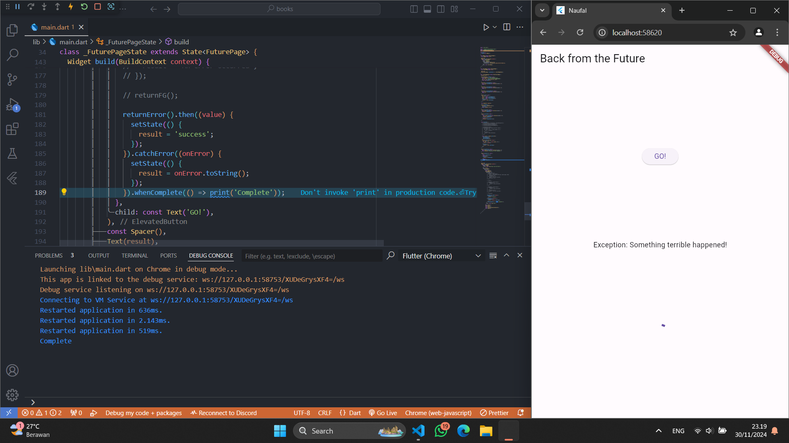

## This repository is belongs to

Muhammad Naufal Haidar Setyawan <br>
2241720097 / TI-3F <br>

### Praktikum 1: Mengunduh Data dari Web Service (API)

#### Langkah 1: Buat Project Baru

Buatlah sebuah project flutter baru dengan nama **books** di folder **src week-12** repository GitHub Anda.

Kemudian Tambahkan dependensi `http` dengan mengetik perintah berikut di terminal.

```
flutter pub add http
```

#### Langkah 2: Cek file `pubspec.yaml`

Jika berhasil install plugin, pastikan plugin `http` telah ada di file `pubspec` ini seperti berikut.

```yaml
dependencies:
  flutter:
    sdk: flutter
  http: ^1.1.0
```

#### Langkah 3: Buka file `main.dart`

Ketiklah kode seperti berikut ini.

> **Soal 1**
>
> Tambahkan **nama panggilan Anda** pada `title` app sebagai identitas hasil pekerjaan Anda.
>
> **Jawab :**
>
> 

 <br>

> **Catatan:**
>
> Tidak ada yang spesial dengan kode di `main.dart` tersebut. Perlu diperhatikan di kode tersebut terdapat widget `CircularProgressIndicator` yang akan menampilkan animasi berputar secara terus-menerus, itu pertanda bagus bahwa aplikasi Anda responsif (tidak freeze/lag). Ketika animasi terlihat berhenti, itu berarti UI menunggu proses lain sampai selesai.

#### Langkah 4: Tambah method `getData()`

Tambahkan method ini ke dalam `class _FuturePageState` yang berguna untuk mengambil data dari API Google Books. <br>

 <br>

> **Soal 2**
>
> - Carilah judul buku favorit Anda di Google Books, lalu ganti ID buku pada variabel `path` di kode tersebut. Caranya ambil di URL browser Anda seperti gambar berikut ini.
>   
>
> - Kemudian cobalah akses di browser URI tersebut dengan lengkap seperti ini. Jika menampilkan data JSON, maka Anda telah berhasil. Lakukan _capture_ milik Anda dan tulis di `README` pada laporan praktikum. Lalu lakukan commit dengan pesan "**W12: Soal 2**".
>   
>
> **Jawab :**
>
>  

#### Langkah 5: Tambah kode di `ElevatedButton`

Tambahkan kode pada `onPressed` di `ElevatedButton` seperti berikut. <br>

 <br>

Lakukan run aplikasi Flutter Anda. Anda akan melihat tampilan akhir seperti gambar berikut. Jika masih terdapat error, silakan diperbaiki hingga bisa running.

> **Soal 3**
>
> - Jelaskan maksud kode langkah 5 tersebut terkait `substring` dan `catchError`!
> - Capture hasil praktikum Anda berupa GIF dan lampirkan di README.
>
> **Jawab :**
>
> `Substring` adalah metode untuk memotong dan mengambil string **hanya pada** index tertentu, seperti pada contoh hanya mengambil string dari index 0 hingga 450. Sedangkan `catchError` adalah metode untuk mendeteksi jika ada error maka akan melakukan sesuatu, seperti pada contoh akan mengembalikan `result = 'An error occured'` ketika terjadi suatu error.
>
>  


### Praktikum 2: Menggunakan await/async untuk menghindari callbacks

#### Langkah 1: Buka file `main.dart`

Tambahkan tiga method berisi kode seperti berikut di dalam class `_FuturePageState`.

```dart
Future<int> returnOneAsync() async {
  await Future.delayed(const Duration(seconds: 3));
  return 1;
}

Future<int> returnTwoAsync() async {
  await Future.delayed(const Duration(seconds: 3));
  return 2;
}

Future<int> returnThreeAsync() async {
  await Future.delayed(const Duration(seconds: 3));
  return 3;
}
```

#### Langkah 2: Tambah method `count()`

Lalu tambahkan lagi method ini di bawah ketiga method sebelumnya. <br>

 <br>

#### Langkah 3: Panggil `count()`

Lakukan comment kode sebelumnya, ubah isi kode `onPressed()` menjadi seperti berikut. <br>

 <br>

#### Langkah 4: Run

Akhirnya, **run** atau tekan **F5** jika aplikasi belum running. Maka Anda akan melihat seperti gambar berikut, hasil angka 6 akan tampil setelah delay 9 detik. <br>

 <br>

> **Soal 4**
>
> - Jelaskan maksud kode langkah 1 dan 2 tersebut!
> - Capture hasil praktikum Anda berupa GIF dan lampirkan di README.
>
> **Jawab :**
> Langkah 1 adalah 3 fungsi Future yang mengembalikan masing-masing nilai 1, 2, dan 3 setelah delay 3 detik. Sedangkan langkah 2 adalah fungsi untuk menjalankan ketiga fungsi tersebut secara sekuensial kemudian menjumlahkan hasil dari masing-masing return.
>
>  

### Praktikum 3: Menggunakan Completer di Future

#### Langkah 1: Buka `main.dart`

Pastikan telah impor package async berikut.

```dart
import 'package:async/async.dart';
```

#### Langkah 2: Tambahkan variabel dan method

Tambahkan variabel late dan method di `class _FuturePageState` seperti ini.

```dart
late Completer completer;

Future getNumber() {
  completer = Completer<int>();
  calculate();
  return completer.future;
}

Future calculate() async {
  await Future.delayed(const Duration(seconds : 5));
  completer.complete(42);
}
```

#### Langkah 3: Ganti isi kode `onPressed()`

Tambahkan kode berikut pada fungsi `onPressed()`. Kode sebelumnya bisa Anda comment.


#### Langkah 4:

Terakhir, **run** atau tekan **F5** untuk melihat hasilnya jika memang belum running. Bisa juga lakukan **hot restart** jika aplikasi sudah running. Maka hasilnya akan seperti gambar berikut ini. Setelah 5 detik, maka angka 42 akan tampil.


> **Soal 5**
>
> - Jelaskan maksud kode langkah 2 tersebut!
> - Capture hasil praktikum Anda berupa GIF dan lampirkan di README.
>
> **Jawab :**
> Kode tersebut menggunakan Completer untuk mengelola penyelesaian (completion) dari sebuah Future secara manual.
>
> Mendeklarasikan variabel completer dengan keyword late, yang berarti variabel akan diinisialisasi nanti sebelum digunakan.
>
> Fungsi `getNumber()` membuat instance baru dari `Completer<int>()`.
> Memanggil fungsi `calculate()` yang akan menyelesaikan Completer tersebut.
> Mengembalikan `completer.future`, yaitu sebuah Future yang akan berisi nilai ketika completer selesai (complete).
>
>  

#### Langkah 5: Ganti method `calculate()`

Gantilah isi code method `calculate()` seperti kode berikut, atau Anda dapat membuat `calculate2()`


#### Langkah 6: Pindah ke `onPressed()`

Ganti menjadi kode seperti berikut.

```dart
getNumber().then((value) {
  setState(() {
    result = value.toString();
  });
}).catchError((e) {
  result = 'An error occurred';
});
```

> **Soal 6**
>
> - Jelaskan maksud perbedaan kode langkah 2 dengan langkah 5-6 tersebut!
> - Capture hasil praktikum Anda berupa GIF dan lampirkan di README.
>
> **Jawab :**
> Kode langkah 2 menggunakan Completer untuk mengelola penyelesaian (completion) dari sebuah Future secara manual tanpa melakukan handle jika terjadi error.
>
> Sedangkan kode langkah 5-6 menggunakan Completer dengan Future.delayed untuk menunda eksekusi kode selama 5 detik dan menerapkan try-catch untuk menangkap error yang terjadi dan completer.completeError() untuk menyelesaikan Completer dengan error.
>
>  

### Praktikum 4: Memanggil Future secara paralel

#### Langkah 1: Buka file `main.dart`

Tambahkan method ini ke dalam `class _FuturePageState`


#### Langkah 2: Edit `onPressed()`

Anda bisa hapus atau comment kode sebelumnya, kemudian panggil method dari langkah 1 tersebut.


#### Langkah 3: Run

Anda akan melihat hasilnya dalam 3 detik berupa angka 6 lebih cepat dibandingkan praktikum sebelumnya menunggu sampai 9 detik.

> Soal 7
>
> - Capture hasil praktikum Anda berupa GIF dan lampirkan di README. Lalu lakukan commit dengan pesan "**W12: Soal 7**".
>
> **Jawab :** > 

#### Langkah 4: Ganti variabel `futureGroup`

Anda dapat menggunakan FutureGroup dengan `Future.wait` seperti kode berikut.

```dart
final futures = Future.wait<int>([
  returnOneAsync(),
  returnTwoAsync(),
  returnThreeAsync(),
]);
```

> Soal 8
>
> - Jelaskan maksud perbedaan kode langkah 1 dan 4!
>
> **Jawab :**
> Kode langkah 1 menggunakan FutureGroup untuk mengelola beberapa Future secara paralel. Sedangkan kode langkah 4 menggunakan Future.wait untuk menjalankan beberapa Future secara paralel dan mengembalikan Future yang akan menyelesaikan ketika semua Future selesai.
>
> Keduanya digunakan untuk menunggu beberapa Future selesai, tetapi FutureGroup memberikan fleksibilitas lebih dalam menambahkan Future secara dinamis

### Praktikum 5: Menangani Respon Error pada Async Code

#### Langkah 1: Buka file `main.dart`

Tambahkan method ini ke dalam `class _FuturePageState` <br>

 <br>

#### Langkah 2: ElevatedButton

Ganti dengan kode berikut <br>

 <br>

#### Langkah 3: Run

Lakukan run dan klik tombol **GO!** maka akan menghasilkan seperti gambar berikut.<br>

 <br>

Pada bagian debug console akan melihat teks `Complete` seperti berikut.<br>

 <br>

> **Soal 9**
>
> - Capture hasil praktikum Anda berupa GIF dan lampirkan di README. Lalu lakukan commit dengan pesan "**W12: Soal 9**".
>
> **Jawab :** > 

#### Langkah 4: Tambah method `handleError()`

Tambahkan kode ini di dalam `class _FutureStatePage` <br>

 <br>

> **Soal 10**
>
> - Panggil method `handleError()` tersebut di `ElevatedButton`, lalu run. Apa hasilnya? Jelaskan perbedaan kode langkah 1 dan 4!
>
> **Jawab :**
> Hasilnya akan menampilkan `complete` pada console. Perbedaan kode langkah 1 dan 4 adalah kode langkah 1 menggunakan catchError untuk menangkap error yang terjadi pada kode dan onComplete untuk menampilkan hasilnya di console. Sedangkan kode langkah 4 menggunakan try-catch pada method `returnError` untuk menangkap error yang terjadi dan menggunakan finally untuk menampilkan hasilnya di console.

### Praktikum 6: Menggunakan Future dengan StatefulWidget

#### Langkah 1: install plugin geolocator

Tambahkan plugin geolocator dengan mengetik perintah berikut di terminal.

```
flutter pub add geolocator
```

#### Langkah 2: Tambah permission GPS

Jika Anda menargetkan untuk platform **Android**, maka tambahkan baris kode berikut di file `android/app/src/main/androidmanifest.xml`

```xml
<uses-permission android:name="android.permission.ACCESS_FINE_LOCATION"/>
<uses-permission android:name="android.permission.ACCESS_COARSE_LOCATION"/>
```

Jika Anda menargetkan untuk platform **iOS**, maka tambahkan kode ini ke file `Info.plist`

```xml
<key>NSLocationWhenInUseUsageDescription</key>
<string>This app needs to access your location</string>
```

#### Langkah 3: Buat file `geolocation.dart`

Tambahkan file baru ini di folder lib project Anda.

#### Langkah 4: Buat StatefulWidget

Buat `class LocationScreen` di dalam file `geolocation.dart`

#### Langkah 5: Isi kode `geolocation.dart`

 <br>

> **Soal 11**
>
> - Tambahkan **nama panggilan Anda** pada tiap properti `title` sebagai identitas pekerjaan Anda.
>
> **Jawab :** > 

#### Langkah 6: Edit `main.dart`

Panggil screen baru tersebut di file main Anda seperti berikut.

```dart
home: LocationScreen(),
```

#### Langkah 7: Run

Run project Anda di **device** atau **emulator (bukan browser)**, maka akan tampil seperti berikut ini. <br>

 <br>

#### Langkah 8: Tambahkan animasi loading

Tambahkan widget loading seperti kode berikut. Lalu hot restart, perhatikan perubahannya. <br>

 <br>

> **Soal 12**
>
> - Jika Anda tidak melihat animasi loading tampil, kemungkinan itu berjalan sangat cepat. Tambahkan delay pada method `getPosition()` dengan kode `await Future.delayed(const Duration(seconds: 3));`
> - Apakah Anda mendapatkan koordinat GPS ketika run di browser? Mengapa demikian?
> - Capture hasil praktikum Anda berupa GIF dan lampirkan di README. Lalu lakukan commit dengan pesan "**W12: Soal 12**".
>
> **Jawab :**
>
> - Menambahkan delay pada method getPosition() dengan kode `await Future.delayed(const Duration(seconds: 3));`.
> - Ya, karena browser memiliki akses ke GPS sehingga dapat menampilkan koordinat GPS. Dapat dibuktikan dengan browser meminta akses GPS pada saat pertama kali.
>   

### Praktikum 7: Manajemen Future dengan FutureBuilder

#### Langkah 1: Modifikasi method `getPosition()`

Buka file `geolocation.dart` kemudian ganti isi method dengan kode ini.<br>

 <br>

#### Langkah 2: Tambah variabel

Tambah variabel ini di `class _LocationScreenState`<br>

 <br>

#### Langkah 3: Tambah `initState()`

Tambah method ini dan set variabel `position` <br>

 <br>

#### Langkah 4: Edit method `build()`

Ketik kode berikut dan sesuaikan. Kode lama bisa Anda comment atau hapus. <br>

 <br>

> **Soal 13**
>
> - Apakah ada perbedaan UI dengan praktikum sebelumnya? Mengapa demikian?
> - Capture hasil praktikum Anda berupa GIF dan lampirkan di README. Lalu lakukan commit dengan pesan "**W12: Soal 13**".
> - Seperti yang Anda lihat, menggunakan FutureBuilder lebih efisien, clean, dan reactive dengan Future bersama UI.
>
> **Jawab :**
> Tidak ada perbedaan UI yang signifikan dengan praktikum sebelumnya. Hal ini dikarenakan menggunakan FutureBuilder yang akan menampilkan widget sesuai dengan status Future.

#### Langkah 5: Tambah handling error

Tambahkan kode berikut untuk menangani ketika terjadi error. Kemudian hot restart.

```dart
else if (snapshot.connectionState == ConnectionState.done) {
  if (snapshot.hasError) {
     return Text('Something terrible happened!');
  }
  return Text(snapshot.data.toString());
}
```

> **Soal 14**
>
> - Apakah ada perbedaan UI dengan langkah sebelumnya? Mengapa demikian?
> - Capture hasil praktikum Anda berupa GIF dan lampirkan di README. Lalu lakukan commit dengan pesan "**W12: Soal 14**".
>
> **Jawab :**
> Tidak ada perbedaan UI yang signifikan dengan praktikum sebelumnya. Hal ini dikarenakan menggunakan FutureBuilder yang akan menampilkan widget sesuai dengan status Future dan menambahkan handle error jika terjadi error.

### Praktikum 8: Navigation route dengan Future Function

#### Langkah 1: Buat file baru `navigation_first.dart`

Buatlah file baru ini di project lib Anda.

### Langkah 2: Isi kode `navigation_first.dart`

 <br>

> **Soal 15**
>
> - Tambahkan **nama panggilan Anda** pada tiap properti `title` sebagai identitas pekerjaan Anda.
> - Silakan ganti dengan warna tema favorit Anda.
>
> **Jawab :** > 

#### Langkah 3: Tambah method di class `_NavigationFirstState`

Tambahkan method ini.

```dart
Future _navigateAndGetColor(BuildContext context) async {
   color = await Navigator.push(context,
        MaterialPageRoute(builder: (context) => const NavigationSecond()),) ?? Colors.blue;
   setState(() {});
   });
}
```

#### Langkah 4: Buat file baru `navigation_second.dart`

Buat file baru ini di project lib Anda. Silakan jika ingin mengelompokkan view menjadi satu folder dan sesuaikan impor yang dibutuhkan.

#### Langkah 5: Buat class NavigationSecond dengan StatefulWidget

 <br>

#### Langkah 6: Edit `main.dart`

Lakukan edit properti home.

```dart
home: const NavigationFirst(),
```

#### Langkah 8: Run

Lakukan run, jika terjadi error silakan diperbaiki.

> **Soal 16**
>
> - Cobalah klik setiap button, apa yang terjadi ? Mengapa demikian ?
> - Gantilah 3 warna pada langkah 5 dengan warna favorit Anda!
> - Capture hasil praktikum Anda berupa GIF dan lampirkan di README. Lalu lakukan commit dengan pesan "**W12: Soal 16**".
>
> **Jawab :**
> Ketika button change color diklik, maka akan menampilkan halaman kedua, di halaman kedua terdapat 3 button yang masing-masing akan mengubah warna background pada halaman pertama.

Hasilnya akan seperti gambar berikut ini. <br>

  <br>

### Praktikum 9: Memanfaatkan async/await dengan Widget Dialog

#### Langkah 1: Buat file baru `navigation_dialog.dart`

Buat file dart baru di folder lib project Anda.

#### Langkah 2: Isi kode `navigation_dialog.dart`

 <br>

#### Langkah 3: Tambah method async

 <br>

#### Langkah 4: Panggil method di `ElevatedButton`

 <br>

#### Langkah 5: Edit `main.dart`

Ubah properti home <br>

 <br>

#### Langkah 6: Run

Coba ganti warna background dengan widget dialog tersebut. Jika terjadi error, silakan diperbaiki. Jika berhasil, akan tampil seperti gambar berikut. <br>

 <br>

> **Soal 17**
>
> - Cobalah klik setiap button, apa yang terjadi ? Mengapa demikian ?
> - Gantilah 3 warna pada langkah 3 dengan warna favorit Anda!
> - Capture hasil praktikum Anda berupa GIF dan lampirkan di README. Lalu lakukan commit dengan pesan "**W12: Soal 17**".
>
> **Jawab :**
> Ketika button change color diklik, maka akan menampilkan dialog yang berisi 3 button yang masing-masing akan mengubah warna background pada halaman pertama.
