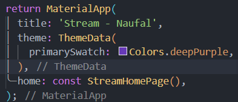
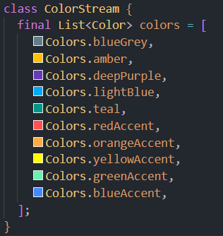

## This repository is belongs to

Muhammad Naufal Haidar Setyawan <br>
2241720097 / TI-3F <br>

### Praktikum 1: Dart Streams

#### Langkah 1: Buat Project Baru

Buatlah sebuah project flutter baru dengan nama **stream_nama** (beri nama panggilan Anda) di folder **week-13/src/** repository GitHub Anda.

#### Langkah 2: Buka file `main.dart`

Ketiklah kode seperti berikut ini. <br>

 <br>
 <br>

> **Soal 1**
>
> - Tambahkan **nama panggilan Anda** pada `title` app sebagai identitas hasil pekerjaan Anda.
> - Gantilah warna tema aplikasi sesuai kesukaan Anda.
>
> **Jawab :** > 

#### Langkah 3: Buat file baru `stream.dart`

Buat file baru di folder lib project Anda. Lalu isi dengan kode berikut.<br>

 <br>

#### Langkah 4: Tambah variabel `colors`

Tambahkan variabel di dalam `class ColorStream` seperti berikut. <br>

 <br>

> **Soal 2**
>
> - Tambahkan 5 warna lainnya sesuai keinginan Anda pada variabel `colors` tersebut.
>
> **Jawab :** > 

#### Langkah 5: Tambah method `getColors()`

Di dalam `class ColorStream` ketik method seperti kode berikut. Perhatikan tanda bintang di akhir keyword `async*` (ini digunakan untuk melakukan `Stream` data) <br>

 <br>

#### Langkah 6: Tambah perintah `yield*`

Tambahkan kode berikut ini.

```dart
yield* Stream.periodic(
const Duration(seconds: 1), (int t) {
int index = t % colors.length;
return colors[index];
});
```

> **Soal 3**
>
> - Jelaskan fungsi keyword `yield*` pada kode tersebut!
> - Apa maksud isi perintah kode tersebut?
>
> **Jawab :**
>
> Fungsi keyword yield\* pada kode tersebut adalah untuk mengembalikan nilai dari sebuah fungsi generator. Fungsi generator adalah fungsi yang menghasilkan nilai secara berurutan. Fungsi generator menggunakan kata kunci yield untuk mengembalikan nilai.
>
> Maksud dari isi perintah kode tersebut adalah untuk mengembalikan nilai dari sebuah fungsi generator yang berisi list warna yang telah didefinisikan sebelumnya.

#### Langkah 7: Buka `main.dart`

Ketik kode impor file ini pada file `main.dart`

```dart
import 'stream.dart';
```

#### Langkah 8: Tambah variabel

Ketik dua properti ini di dalam `class _StreamHomePageState` <br>

 <br>

#### Langkah 9: Tambah method `changeColor()`

Tetap di file main, Ketik kode seperti berikut <br>

 <br>

#### Langkah 10: Lakukan override `initState()`

Ketika kode seperti berikut <br>

 <br>

#### Langkah 11: Ubah isi `Scaffold()`

Sesuaikan kode seperti berikut. <br>

 <br>

#### Langkah 12: Run

Lakukan running pada aplikasi Flutter Anda, maka akan terlihat berubah warna background setiap detik. <br>

  <br>

#### Langkah 13: Ganti isi method `changeColor()`

Anda boleh comment atau hapus kode sebelumnya, lalu ketika kode seperti berikut. <br>

 <br>

> **Soal 5**
>
> - Jelaskan perbedaan menggunakan `listen` dan `await for` (langkah 9) !
>
> **Jawab :**
>
> - `listen` digunakan untuk mendengarkan perubahan pada stream yang diberikan. Ketika stream tersebut mengeluarkan data, maka listen akan mengeksekusi kode yang ada di dalamnya.
> - `await for` digunakan untuk menunggu stream yang diberikan mengeluarkan data. Ketika stream tersebut mengeluarkan data, maka await for akan mengeksekusi kode yang ada di dalamnya.

> **Catatan**: Stream di Flutter memiliki fitur yang powerfull untuk menangani data secara async. Stream dapat dimanfaatkan pada skenario dunia nyata seperti real-time messaging, unggah dan unduh file, tracking lokasi user, bekerja dengan data sensor IoT, dan lain sebagainya.

### Praktikum 2: Stream controllers dan sinks

#### Langkah 1: Buka file `stream.dart`

Lakukan impor dengan mengetik kode ini.

```dart
import 'dart:async';
```

#### Langkah 2: Tambah `class NumberStream`

Tetap di `file stream.dart` tambah class baru seperti berikut. <br>

 <br>

#### Langkah 3: Tambah `StreamController`

Di dalam `class NumberStream` buatlah variabel seperti berikut. <br>

 <br>

#### Langkah 4: Tambah method `addNumberToSink`

Tetap di `class NumberStream` buatlah method ini <br>

 <br>

#### Langkah 5: Tambah method `close()`

 <br>

#### Langkah 6: Buka `main.dart`

Ketik kode import seperti berikut <br>

 <br>

#### Langkah 7: Tambah variabel

Di dalam `class _StreamHomePageState` ketik variabel berikut <br>

 <br>

#### Langkah 8: Edit `initState()`

 <br>

#### Langkah 9: Edit `dispose()`

 <br>

#### Langkah 10: Tambah method `addRandomNumber()`

```dart
void addRandomNumber() {
  Random random = Random();
  int myNum = random.nextInt(10);
  numberStream.addNumberToSink(myNum);
}
```

#### Langkah 11: Edit method `build()`

 <br>

#### Langkah 12: Run

Lakukan running pada aplikasi Flutter Anda, maka akan terlihat seperti gambar berikut. <br>

 <br>

> **Soal 6**
>
> - Jelaskan maksud kode langkah 8 dan 10 tersebut!
>
> **Jawab :**
> Maksud dari kode langkah 8 adalah untuk menginisialisasi variabel lastNumber, StreamController, dan NumberStream. Variabel lastNumber digunakan untuk menyimpan nilai terakhir dari stream yang dihasilkan. StreamController digunakan untuk mengontrol stream yang dihasilkan. NumberStream digunakan untuk mengatur stream yang dihasilkan.
> Sedangkan maksud dari kode langkah 10 adalah untuk menambahkan angka random dari 0-9 ke dalam stream yang dihasilkan. Angka random tersebut akan ditambahkan ke dalam sink yang ada pada stream yang dihasilkan.

#### Langkah 13: Buka `stream.dart`

Tambahkan method berikut ini. <br>

 <br>

#### Langkah 14: Buka `main.dart`

Tambahkan method `onError` di dalam `class StreamHomePageState` pada method `listen` di fungsi `initState()` seperti berikut ini. <br>

 <br>

#### Langkah 15: Edit method `addRandomNumber()`

Lakukan _comment_ pada dua baris kode berikut, lalu ketik kode seperti berikut ini. <br>

 <br>

> **Soal 7**
>
> - Jelaskan maksud kode langkah 13 sampai 15 tersebut!
> - Kembalikan kode seperti semula pada Langkah 15, comment `addError()` agar Anda dapat melanjutkan ke praktikum 3 berikutnya.
>
> **Jawab :**
> Maksud dari kode langkah 13 adalah untuk menambahkan error ke dalam stream yang dihasilkan. Error tersebut akan ditambahkan ke dalam sink yang ada pada stream yang dihasilkan.

### Praktikum 3: Injeksi data ke streams

#### Langkah 1: Buka `main.dart`

Tambahkan variabel baru di dalam `class _StreamHomePageState` <br>

 <br>

#### Langkah 2: Tambahkan kode ini di `initState`

 <br>

#### Langkah 3: Tetap di `initState`

Lakukan edit seperti kode berikut. <br>

 <br>

#### Langkah 4: Run

Terakhir, **run** atau tekan **F5** untuk melihat hasilnya jika memang belum running. Bisa juga lakukan **hot restart** jika aplikasi sudah running. Maka hasilnya akan seperti gambar berikut ini. Anda akan melihat tampilan angka dari 0 hingga 90. <br>

 <br>

> **Soal 8**
>
> - Jelaskan maksud kode langkah 1-3 tersebut!
>
> **Jawab :**
>
> - Langkah 1 adalah untuk menambahkan variabel StreamTransformer yang digunakan untuk mengubah data yang diterima dari stream.
> - Langkah 2 adalah untuk menginisialisasi variabel StreamTransformer yang telah didefinisikan sebelumnya.
> - Langkah 3 adalah untuk mengubah bagian streamController yang digunakan untuk mengontrol stream yang dihasilkan.

### Praktikum 4: Subscribe ke stream events

#### Langkah 1: Tambah variabel

Tambahkan variabel berikut di `class _StreamHomePageState` <br>

 <br>

#### Langkah 2: Edit `initState()`

Edit kode seperti berikut ini. <br>

 <br>

#### Langkah 3: Tetap di `initState()`

Tambahkan kode berikut ini. <br>

 <br>

#### Langkah 4: Tambah properti `onDone()`

Tambahkan dibawahnya kode ini setelah `onError` <br>

 <br>

#### Langkah 5: Tambah method baru

Ketik method ini di dalam `class _StreamHomePageState` <br>

 <br>

#### Langkah 6: Pindah ke method `dispose()`

Jika method `dispose()` belum ada, Anda dapat mengetiknya dan dibuat override. Ketik kode ini didalamnya. <br>

 <br>

#### Langkah 7: Pindah ke method `build()`

Tambahkan button kedua dengan isi kode seperti berikut ini.<br>

 <br>

#### Langkah 8: Edit method `addRandomNumber()`

Edit kode seperti berikut ini. <br>

 <br>

#### Langkah 9: Run

Anda akan melihat dua button seperti gambar berikut. <br>

 <br>

#### Langkah 10: Tekan button ‘Stop Subscription'

Anda akan melihat pesan di Debug Console seperti berikut. <br>

 <br>

> **Soal 9**
>
> - Jelaskan maksud kode langkah 2, 6 dan 8 tersebut!
>
> **Jawab :**
>
> - Langkah 2 adalah untuk menginisialisasi variabel StreamSubscription yang digunakan untuk melakukan subscribe ke stream yang dihasilkan.
> - Langkah 6 adalah untuk membatalkan subscribe ke stream yang dihasilkan ketika aplikasi dihentikan.
> - Langkah 8 adalah untuk menambahkan angka random dari 0-9 ke dalam stream yang dihasilkan. Angka random tersebut akan ditambahkan ke dalam sink yang ada pada stream yang dihasilkan.

### Praktikum 5: Multiple stream subscriptions

#### Langkah 1: Buka file `main.dart`

Ketik variabel berikut di `class _StreamHomePageState` <br>

 <br>

#### Langkah 2: Edit `initState()`

Ketik kode seperti berikut. <br>

 <br>

#### Langkah 3: Run

Lakukan run maka akan tampil error seperti gambar berikut. <br>

 <br>

> **Soal 10**
>
> - Jelaskan mengapa error itu bisa terjadi ?
>
> **Jawab :**
> Error terjadi karena stream yang dihasilkan hanya bisa di-subscribe satu kali. Ketika stream tersebut di-subscribe lebih dari satu kali, maka akan terjadi error.

#### Langkah 4: Set broadcast stream

Ketik kode seperti berikut di method `initState()` <br>

 <br>

#### Langkah 5: Edit method `build()`

Tambahkan text seperti berikut <br>

 <br>

#### Langkah 6: Run

Tekan button **‘New Random Number'** beberapa kali, maka akan tampil teks angka terus bertambah sebanyak dua kali. <br>

 <br>

> **Soal 11**
>
> - Jelaskan mengapa hal itu bisa terjadi ?
>
> **Jawab :**
> Hal itu bisa terjadi karena stream yang dihasilkan telah diubah menjadi broadcast stream. Broadcast stream memungkinkan stream yang dihasilkan dapat di-subscribe lebih dari satu kali dan teks akan ditambahkan setiap kali tombol Add Random Number ditekan.

### Praktikum 6: StreamBuilder

#### Langkah 1: Buat Project Baru

Buatlah sebuah project flutter baru dengan nama **streambuilder_nama** (beri nama panggilan Anda) di folder **week-13/src/** repository GitHub Anda.

#### Langkah 2: Buat file baru `stream.dart`

Ketik kode ini <br>

 <br>

#### Langkah 3: Tetap di file `stream.dart`

Ketik kode seperti berikut. <br>

 <br>

#### Langkah 4: Edit `main.dart`

Ketik kode seperti berikut ini. <br>

 <br>
 <br>
 <br>

#### Langkah 5: Tambah variabel

Di dalam `class _StreamHomePageState`, ketika variabel ini. <br>

 <br>

#### Langkah 6: Edit `initState()`

Ketik kode seperti berikut. <br>

 <br>

#### Langkah 7: Edit method `build()`

 <br>
 <br>

#### Langkah 8: Run

Hasilnya, setiap detik akan tampil angka baru seperti berikut. <br>

 <br>

> **Soal 12**
>
> - Jelaskan maksud kode pada langkah 3 dan 7 !
>
> **Jawab :**
>
> - Langkah 3 adalah untuk membuat method getNumbers() yang digunakan untuk menghasilkan stream yang berisi list angka random dari 0-9.
> - Langkah 7 adalah untuk menampilkan hasil stream yang dihasilkan ke dalam aplikasi menggunakan StreamBuilder.

### Praktikum 7: BLoC Pattern

#### Langkah 1: Buat Project baru

Buatlah sebuah project flutter baru dengan nama **bloc_random_nama** (beri nama panggilan Anda) di folder **week-13/src/** repository GitHub Anda. Lalu buat file baru di folder `lib` dengan nama `random_bloc.dart`

#### Langkah 2: Isi kode `random_bloc.dart`

Ketik kode impor berikut ini. <br>

 <br>

#### Langkah 3: Buat `class RandomNumberBloc()`

 <br>

#### Langkah 4: Buat variabel StreamController

Di dalam `class RandomNumberBloc()` ketik variabel berikut ini <br>

 <br>

#### Langkah 5: Buat constructor

 <br>

#### Langkah 6: Buat method `dispose()`

 <br>

#### Langkah 7: Edit `main.dart`

 <br>

#### Langkah 8: Buat file baru `random_screen.dart`

Di dalam folder lib project Anda, buatlah file baru ini.

#### Langkah 9: Lakukan impor material dan `random_bloc.dart`

Ketik kode ini di file baru `random_screen.dart` <br>

 <br>

#### Langkah 10: Buat StatefulWidget RandomScreen

Buatlah di dalam file `random_screen.dart`

#### Langkah 11: Buat variabel

Ketik kode ini di dalam `class _RandomScreenState` <br>

 <br>

#### Langkah 12: Buat method `dispose()`

Ketik kode ini di dalam `class _StreamHomePageState` <br>

 <br>

#### Langkah 13: Edit method `build()`

Ketik kode ini di dalam `class _StreamHomePageState` <br>

 <br>

Run aplikasi, maka Anda akan melihat angka acak antara angka 0 sampai 9 setiap kali menekan tombol `FloactingActionButton`.

> **Soal 13**
>
> - Jelaskan maksud praktikum ini ! Dimanakah letak konsep pola BLoC-nya ?
>
> **Jawab :**
> Maksud dari praktikum ini adalah untuk membuat aplikasi yang menggunakan pola BLoC. Pola BLoC adalah pola yang digunakan untuk memisahkan antara logika bisnis dan tampilan. Konsep pola BLoC terletak pada class RandomNumberBloc() yang digunakan untuk mengatur stream yang dihasilkan. setiap perubahan pada stream akan diatur oleh class RandomNumberBloc() dan akan ditampilkan ke dalam aplikasi menggunakan StreamBuilder.
